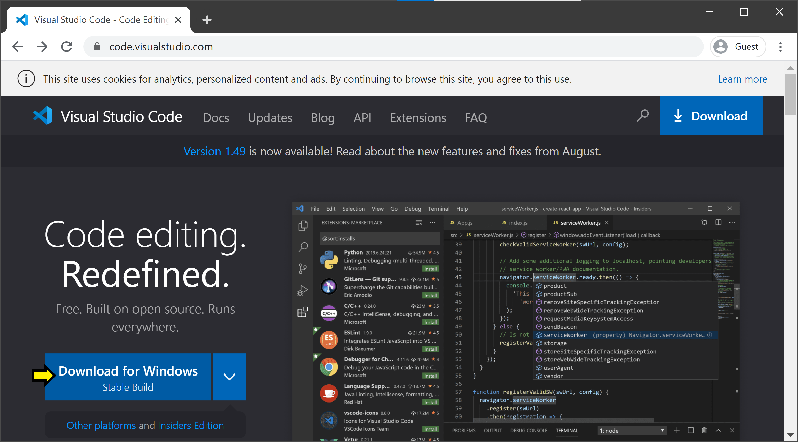
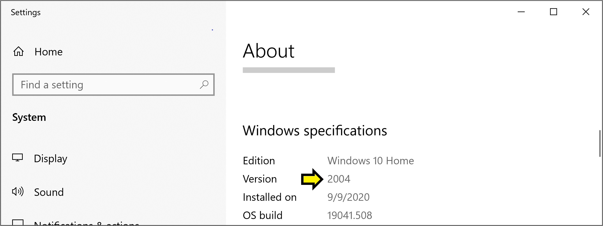
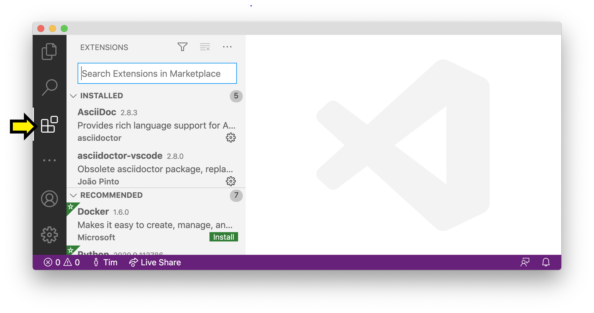

# Windows

Follow the instructions below to install Visual Studio Code (VS Code), Windows OpenSSH Client, and the Remote-SSH and Python VS Code extensions.

## VS Code

1. Go to Visual Studio Code's [home page](https://code.visualstudio.com/). You should see a blue button labeled "Download for Windows: Stable Build". Click this button to download.

{:style="counter-reset:none"}
1. Once it is downloaded, run the installer (VSCodeUserSetup-<version>.exe). After you accept the licence agreement, click "Next >". On the page titled "Select Additional Tasks," we recommend you check all the boxes (but it is up to you).

{:style="counter-reset:none"}
1. Click "Next >", then click "Install". When the progress bar fills, click "Finish".

## OpenSSH

In this step, you will install Windows OpenSSH Client, which requires a recent version of Windows 10 or higher.

{: .warning }
Are you using an older PC with Windows 7 or 8? If so, please reach out to the instructors on [Ed](https://edstem.org/us/courses/42535/discussion/) for guidance.

### Checking Your PC Version

1. Open the Start menu by clicking on the Windows logo in the bottom lefthand corner of your screen. Begin typing "About your PC", and click on the option when it appears.

{:style="counter-reset:none"}
1. Scroll down to the heading "Windows specifications". Next to Edition, you should see Windows 10 Home, Windows 10 Pro, Windows 11 Home, Windows 11 Pro, or similar. Below that you should see Version and a number like "2004". If you have Windows 10 and that number is less than 1803, then you need to perform an update.

### Updating Windows 10

1. Open the Start menu, begin typing "Check for updates", and click on the option when it appears.

{:style="counter-reset:none"}
1. The window that opens should have the heading "Windows Update". It may tell you that you have updates available; otherwise, click the button that says "Check for updates".

{:style="counter-reset:none"}
1. Follow the instructions to install the available updates. This may take a few minutes, and your computer may restart. When the update completes, check your version of Windows 10 again, and verify that it now reads as 1803 or greater.

### Installing OpenSSH Client

1. Open the Start menu, begin typing "Manage Optional Features", and click the option when it appears.

{:style="counter-reset:none"}
1. You should see a window that looks like this, with the heading "Optional features".

{:style="counter-reset:none"}
1. Scroll through the list of Installed features. If OpenSSH Client appears in the list, you are done with this step. Otherwise, click on "+ Add a feature" at the top of the page. You will get a pop-up window with the heading "Add an optional feature". Start typing "OpenSSH Client". When the option appears, click on the checkbox next to it.

{:style="counter-reset:none"}
1. Then click on the button labeled "Install (1)". Wait for the progress bar to fill.

{:style="counter-reset:none"}
1. Confirm that the installation was successful by typing "Windows PowerShell" and clicking on the option that appears.

{:style="counter-reset:none"}
1. When the prompt opens, type `ssh` and confirm that a list of available options for the command is displayed:

## Remote-SSH and Python Extensions

1. At this point, VS Code should be among your installed applications. Open it. In the left sidebar, there is an icon consisting of four squares, with one square separated off from the other three. This is the icon for VSCode extensions. Click it to open the Extensions Panel (alternatively, you can press Ctrl-Shift-X).

{:style="counter-reset:none"}
1. Search for and install the extensions "Python (Microsoft)" and "Remote - SSH (Microsoft)". To do this, click in the search bar ("Search Extensions in Marketplace") and start typing the name of the extension. When it appears, make sure the name and publisher matches exactly, and click "Install".

## Next Steps

Installing this software brings us one step closer to utilizing university servers for coding assignments. We'll explain how to remotely connect to these servers using SSH and VS Code in our first camp session.