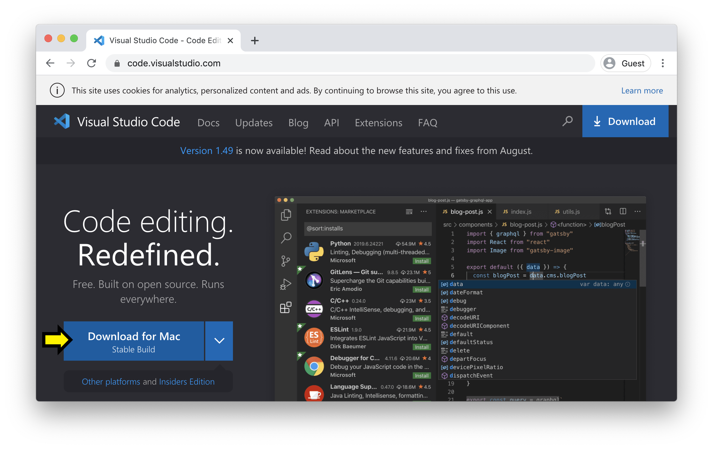
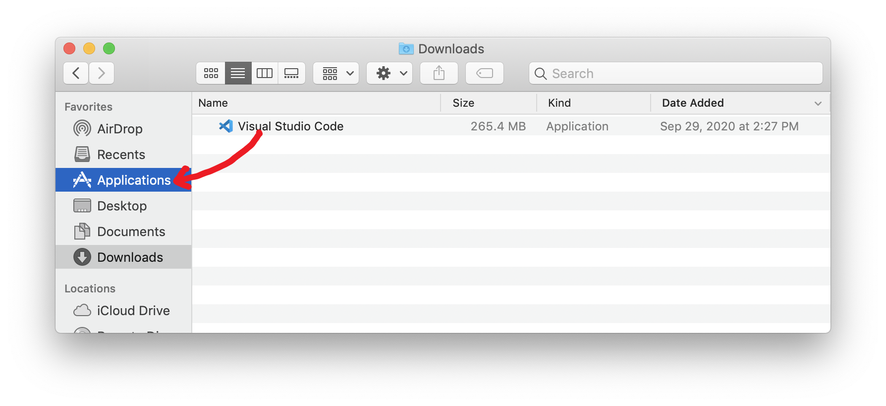
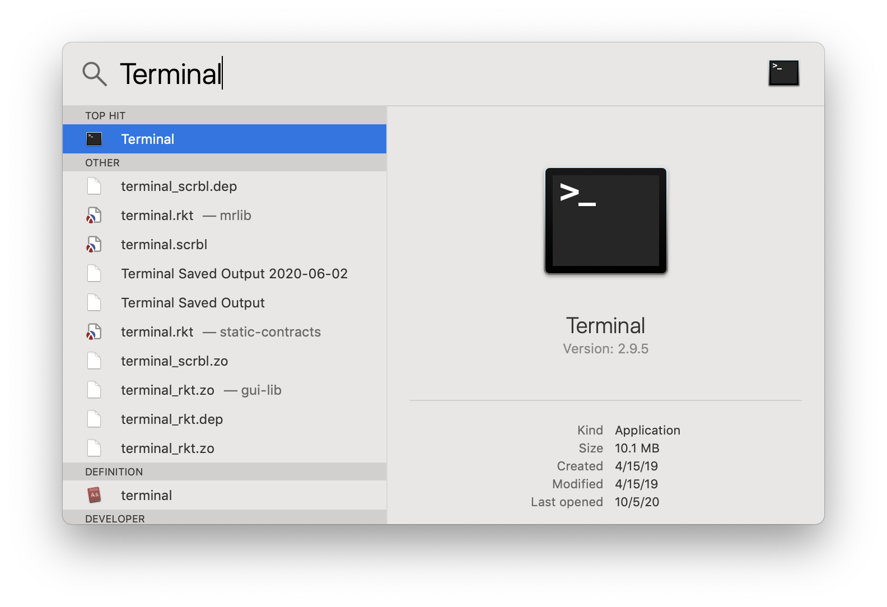
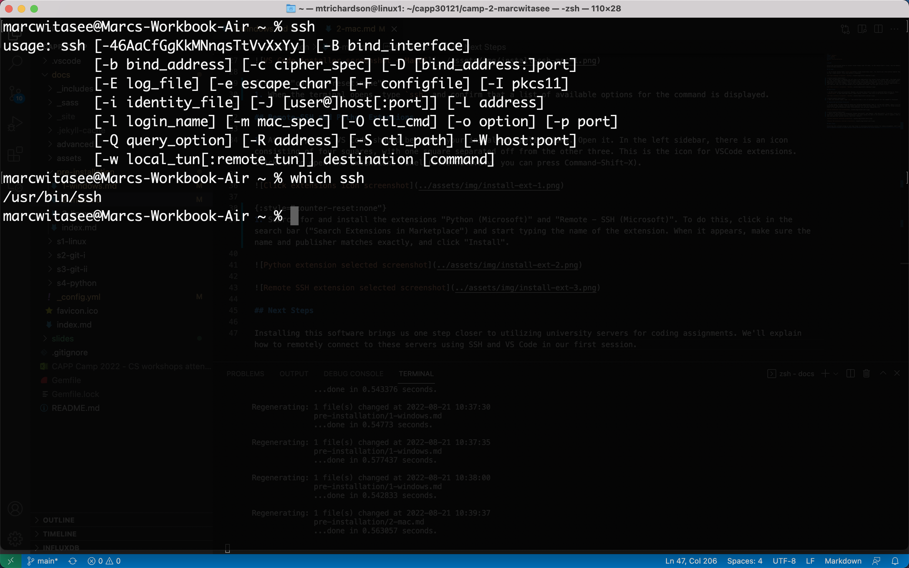

# MacOS

Follow the instructions below to install Visual Studio Code (VS Code), an SSH (Secure Shell) client, and the Remote-SSH and Python VS Code extensions.

## VS Code

1. Go to Visual Studio Code's [home page](https://code.visualstudio.com/). You should see a blue button labeled "Download for Mac: Stable Build". Click this button to download.

{:style="counter-reset:none"}
1. When the download is complete, you will have a new application file called "Visual Studio Code". (You might instead have zip file, with a name like VSCode-darwin-stable.zip; in this case, open the file to unzip it, and the Visual Studio Code application file should appear.) Open a Finder window and navigate to Downloads. (It will likely be listed under "Favorites" in the left sidebar). Locate the file named "Visual Studio Code", and drag it on top of Applications in the left side bar. Now, you can find VSCode in your Applications folder, and can open it with a click.

## SSH Client

1. An SSH client comes pre-installed. However, you should check that it works as expected before moving on. Press `Command-Space` to open Spotlight Search. Begin typing "Terminal", and click on the option when it appears:

{:style="counter-reset:none"}
1. When the terminal opens, type `ssh` and hit enter. Confirm that a list of available options for the command is displayed.

{: .note}
You can also search for a particular program or "binary" from your computer's terminal using the command `which <command>`. This command will tell you the path of where a given program is being executed.

## Remote-SSH and Python Extensions

1. At this point, VS Code should be among your installed applications. Open it. In the left sidebar, there is an icon consisting of four squares, with one square separated off from the other three. This is the icon for VSCode extensions. Click it to open the Extensions Panel (alternatively, you can press Command-Shift-X).

{:style="counter-reset:none"}
1. Search for and install the extensions "Python (Microsoft)" and "Remote - SSH (Microsoft)". To do this, click in the search bar ("Search Extensions in Marketplace") and start typing the name of the extension. When it appears, make sure the name and publisher matches exactly, and click "Install".

## Next Steps

Installing this software brings us one step closer to utilizing university servers for coding assignments. We'll explain how to remotely connect to these servers using SSH and VS Code in our first session.