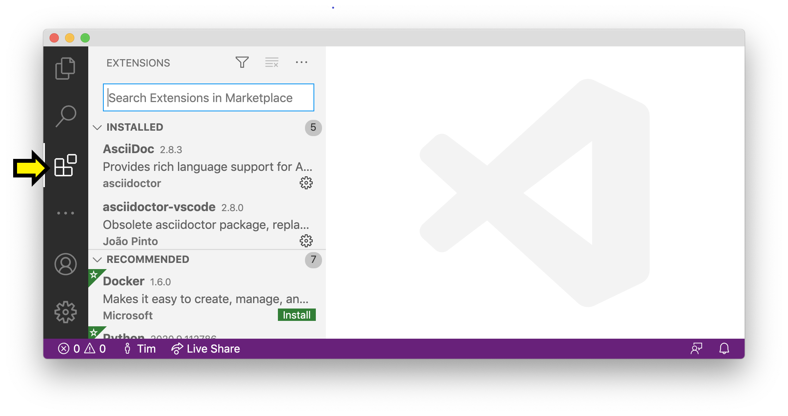
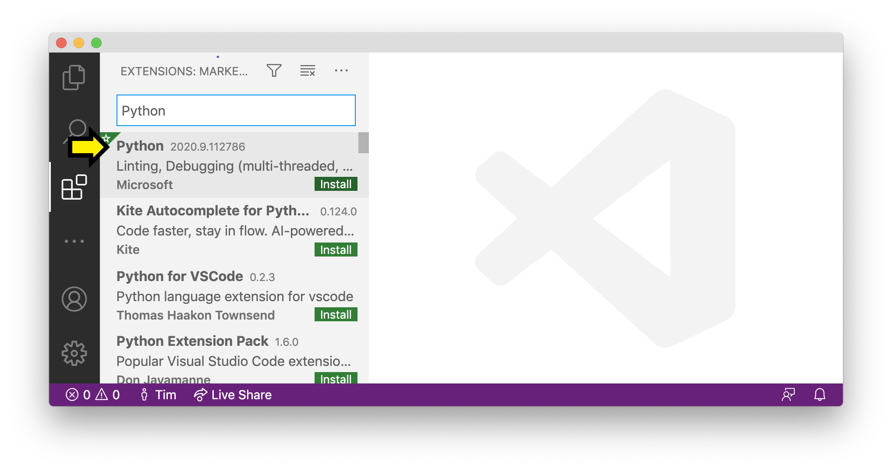
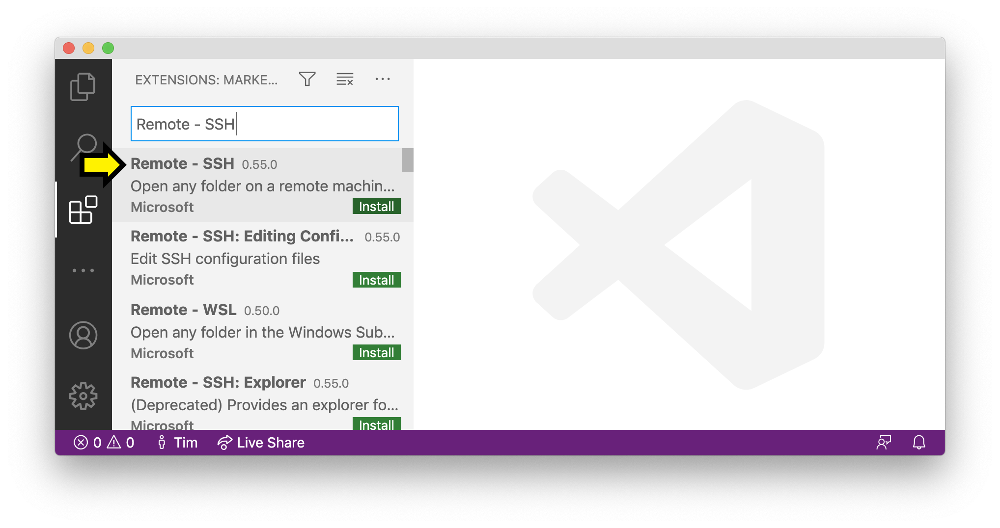

# Linux

Follow the instructions below to install Visual Studio Code (VS Code), an SSH (Secure Shell) client, and the Remote-SSH and Python VS Code extensions.

## VS Code

Go to Visual Studio Code's [downloads page](https://code.visualstudio.com/download) to view installation options.

## SSH Client

If your distribution is Debian or Ubuntu, run:

```bash
sudo apt-get install openssh-client
```

Otherwise, if your distribution is RHEL, Fedora, or CentOS, run:

```bash
sudo yum install openssh-clients
```

{: .note}
> To check your distribution, run the command `uname -a`:
> 
> ```
> $ uname -a
> Linux linux1 5.4.0-113-generic #127-Ubuntu SMP Wed May 18 14:30:56 UTC 2022 x86_64 x86_64 x86_64 GNU/Linux
> ```

After the step has completed, verify installation by typing `ssh` and pressing "Enter". You should receive a list of available options for the command.

## Remote-SSH and Python Extensions

1. At this point, VS Code should be among your installed applications. Open it. In the left sidebar, there is an icon consisting of four squares, with one square separated off from the other three. This is the icon for VSCode extensions. Click it to open the Extensions Panel.



{:style="counter-reset:none"}
1. Search for and install the extensions "Python (Microsoft)" and "Remote - SSH (Microsoft)". To do this, click in the search bar ("Search Extensions in Marketplace") and start typing the name of the extension. When it appears, make sure the name and publisher matches exactly, and click "Install".





## Next Steps

Installing this software brings us one step closer to utilizing university servers for coding assignments. We'll explain how to remotely connect to these servers using SSH and VS Code in our first session.