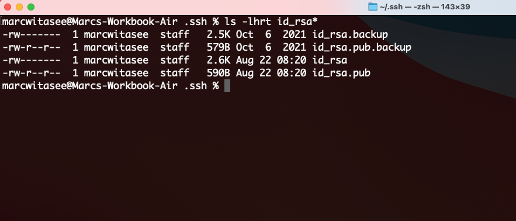
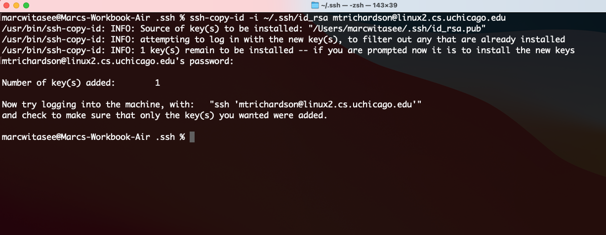

# Connect to the Remote Linux Server

Our first step is to connect to a computer that is running Linux as its operating system. In this section, you will remotely connect to an assigned Linux server hosted by the University. You will use this server over the course of CAPP Camp and CAPP 30121 to work on coding assignments.

## Install Prerequisite Tools

Before getting started, you should have the following tools installed, as detailed in [Pre-Installation](../pre-installation/index.md):

- An SSH Client
- Visual Studio Code
- Visual Studio Code extensions for Python and Remote-SSH

## Step 1. Generate SSH Private-Public Key Pair and Config File

Open Windows PowerShell or macOS Terminal and change your current working directory to the ".ssh" folder using `cd ~/.ssh`.

{: .warning }
> In some cases, you might need to create the .ssh directory before you can change to the directory. You can do this with the `mkdir` command.
>
> ```
> cd
> mkdir .ssh
> cd .ssh
> ```

_Windows_


_macOS_


Create a new key pair using the command `ssh-keygen`. When you do, you will be prompted for a file name and passcode. Simply press ENTER for both of these options until the key is created.

_Windows_


_macOS_


Confirm that two new files, "id_rsa" and "id_rsa.pub", are present by listing the contents of the directory with `ls`. (Note: Because I have other files in the `.ssh` directory unrelated to the camp, I've used a wildcard, denoted by "*",  to only show those that begin with "id_rsa".)

_Windows_


_macOS_



If a file called `config` does not appear in the output, create it using `New-Item config -type file` (Windows) or `touch config` (macOS and Linux).


## Step 2. Copy Public Key to Assigned Remote Server and Authorize

The main Linux server (linux.cs.uchicago.edu) acts as a frontend for specific Linux machines (named linux1.cs.uchicago.edu through linux7.cs.uchicago.edu).


However, VS Code works best when connected with a specific machine rather than to the front end. To avoid having everyone use the same server (e.g., linux1.cs.uchicago.edu) and concentrate too much traffic in one network location, we have assigned you a server to use based on the first letter of your CNetID (i.e., the part of your UChicago email address that comes before the @ sign). For example, my CNetID is `launagreer`, so if I were in your cohort, I would be assigned to linux5.cs.uchicago.edu.

|First Letter of CNetID|Assigned Server|
|---|---|
|A, B|linux1.cs.uchicago.edu|
|C, D, E|linux2.cs.uchicago.edu|
|F, G, H, I, K|linux3.cs.uchicago.edu| 
|J|linux4.cs.uchicago.edu|
|L, M, N, O|linux5.cs.uchicago.edu|
|P, Q, R, X, Y, Z|linux6.cs.uchicago.edu|
|S, T, U, V, W|linux7.cs.uchicago.edu|

Note your assigned server. Then run the following command in your open terminal and enter your UChicago password when prompted. Be sure to replace `<cnetId>` with your CnetID and `<linuxServer>` with your assigned Linux server name (see the table above).

_Windows_

```powershell
type $env:USERPROFILE\.ssh\id_rsa.pub | ssh <cnetId>@<linuxServer> "cat >> .ssh/authorized_keys”
```


_macOS_

```bash
ssh-copy-id -i ~/.ssh/id_rsa <cnetId>@<linuxServer>
```



## Step 3. Configure Remote SSH Connection in VS Code

Open VS Code. On macOS, you can launch VS Code from the Application Launcher. Simply click the Application button (at the top left of your screen), type "code" in the input box, and then click on the Visual Studio Code icon. On Windows, you can search for "Visual Studio Code" on the task bar located at the very bottom of the screen and then click the icon when it appears.

{: .note}
We recommend pinning VS Code to your task bar (Windows) or Dock (macOS) for quick access. On macOS, right click the VS Code icon using your mouse and choose the "Keep in Dock" menu option.  In Windows, right click the icon and then select "Pin to taskbar".

After the application has opened, click the remote connection button with angled braces (><) in the very bottom left-hand corner of the window.

Select "Remote-SSH: Open Configuration File" and then select the config file created in the previous step.


Add an entry resembling the following below, replacing <linuxServer> and <cnetId> with the appropriate values. Then save your changes.

```
Host uchicago
  HostName <linuxServerName>
  IdentityFile ~/.ssh/id_rsa
  User <cnetId>
```


## Step 4. Log into the Remote Server.

Click the bottom left-hand button again, but this time, select "Remote-SSH: Connect to Host". Choose "uchicago" and then wait for the VS Code server to connect to the remote Linux server.

If the connection succeeds, the button should display the text: "SSH: uchicago".


{:style="text-align:center"}
[Previous](./index.html){: .btn } [Next](./2-vs-code-layout.html){: .btn }
