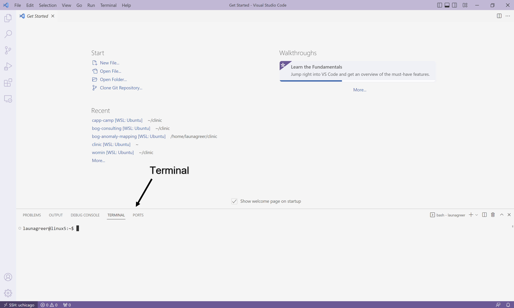

# Get Started with VS Code

Now that we've connected to the remote server, let's take a moment to familiarize ourselves with the default layout of VS Code and open a new terminal.

## Layout


### The Editor

The _editor_ is the main section of the application, where files are edited. It defaults to a "Getting Started" file when you first launch the application if you haven't opened any files for editing yet.

### The Menu Bar

The horizontal bar at the top of the application is known as the _menu bar_. This provides sub-menus allowing you to quickly open your workspace to a new file or folder, save files, and launch new terminals.

### The Activity Bar

The vertical bar on the left-hand side of the application is known as the _activity bar_. Each button will open a different menu:

1. Explorer - Represented by file stack icon. Allows you to view the files and folders of your selected workspace.

2. Search - Represented by a magnifying glass icon. Allows you to search files in your workspace by key terms and perform find and replace operations.

3. Source Control - Represented by an icon for Git. We will review Git in later lab sessions.

4. Run and Debug - Represented by an icon of a play symbol with a bug. We will not cover VS Code's debugger during camp, but it would be a helpful tool to learn for future courses beyond CAPP 30121.

5. Extension Marketplace - Represented by a building blocks icon.  This is a searchable library of programs that enhance the base functionality of VS Code. Both companies and ordinary community members can write extensions for others to install. We are currently using the "Python" and "Remote-SSH" extensions created by Microsoft.

6. Accounts - Represented by a user icon. This allows you to sign into VS Code using an account.

7. Manage - Represented by a gear icon. This allows you to quickly open other areas of VS Code and adjust themes and settings used by the application.

### The Status Bar

The _status bar_, located at the very bottom of the application, shows the number of current code warnings and errors as well as the line number and file type of the file that is currently active in the Editor. The bottom left side of the status bar also includes the remote connection button as a way of quickly configuring, connecting to, and disconnecting from remote hosts. In general, installing a VS Code extension may result in a new button being added to the status or activity bar.

### Panels

Additional panels like terminals can be displayed below or to the side of the Editor. By default, no panels are displayed for a new workspace that hasn't been previously saved. Let's now open a new terminal, which we will use for the remainder of this lab.

## Opening a New Terminal



On your personal computer, you probably navigate your hard drive by double clicking on icons. While convenient for simple tasks, this approach is limited. For example, imagine that you want to delete all of the music files over 5 MB that you haven’t listened to in over a year. This task is very hard to do with the standard double-click interface but is relatively simple using the terminal.

To open a terminal in VS Code, go to the Menu Bar and select "Terminal > New Terminal" (or `Ctrl` followed by backtick `\`` as a shortcut). A terminal window will open at the bottom of the screen in the default Panels location, and you will see text of the form:

```bash
username@computer:~$
```

where `username` has been replaced by your CNetID and `computer` is the name of the Linux server you happen to be using. This string is called the _prompt_. When you start typing, the characters you type will appear to the right of the `$`.

The program that runs within a terminal window and processes the commands that you type is called a _shell_. We use _bash_, which is the default shell on most Linux distributions, but there are other popular shells, such as `ksh`, `tcsh`, etc.

{:style="text-align:center"}
[Previous](./1-connect.html){: .btn } [Next](./3-file-system.html){: .btn }
