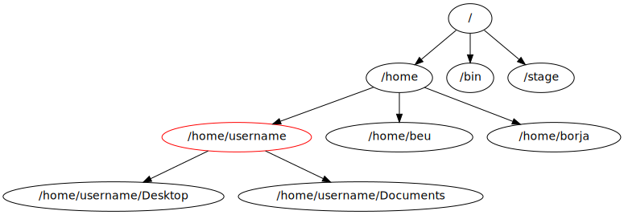

# The Linux File System

In this section, you will learn how to browse the Linux file system using a terminal and make changes to files and directories using the copy (`cp`), move (`mv`), remove (`rm`), and make directory (`mkdir`) commands. You will also learn how to use the wildcard character (`*`) to filter files and directories by name before running commands.

## Browse Directories

Files in Linux are stored in directories/folders, just like in macOS or Windows. Directories can hold files or other subdirectories, and there are special directories for your personal files, your Desktop, etc.

|Name|Linux|Mac|Windows| 
|-|-|-|-|   
|Root directory|/|/|C:\\ |  
|Home directory|/home/username|/Users/username|C:\Documents and Settings\username | 



The figure above illustrates how Linux organizes the file system. Your own computer might have a slightly different organization (e.g., you might replace `/` with `C:`), but the idea is the same.

For the above and from this point forward, consider that the text "username" is replaced with your own actual username, which is just your CNetID.

### Show Files

The terminal will start in your home directory, `/home/username/`, which is a special directory assigned to your user account. Any CS machine that you use (either in CSIL or remotely) will automatically connect to your home directory, and all files that you created or changed in previous work sessions will be available to you.

Two very useful commands are `pwd` and `ls`:

|---|---|
|`pwd`|Prints your current working directory - tells you where you are in your directory tree.| 
|`ls`|Lists all of the files in the current directory.|

The following is an example using these two commands in a terminal window:

```bash
username@computer:~$ pwd
/home/username/
username@computer:~$ ls
cs  html
username@computer:~$
```

Try these commands yourself to verify that everything looks similar.

Notice that the directory path and list of files that you see if you open your home folder graphically are identical to those provided by `pwd` and `ls`, respectively. The only difference is how you get the information, how the information is displayed, and how easy it is to write a script that, say, processes all the Python files in a directory.

### Change Directory

|---|---|
|`cd <path-name>`|Change current directory to the given path.| 
|`cd ..`|Move up/back one directory.|  
|`cd`| Move to your home directory.| 

How can we move around in the file system? If we were using a graphical system, we would double click on folders and occasionally click the "back" arrow. In order to change directories in the terminal, we use `cd` (change directory) followed by the name of the destination directory. (A note about notation: we will use text inside angle brackets, such as `<path-name>` as a place holder. The text informally describes the type of value that should be supplied. In the case of `<path-name>`, the desired value is the path-name for a file. More about path-names later.) For example, if we want to change to the `cs` directory, we type the following in the terminal:

```bash
cd cs
```

Here is an example of changing to the `cs` directory in the terminal. We use `pwd` and `ls` to verify where we are and where we can go:

```bash
username@computer:~$ pwd
/home/username/
username@computer:~$ ls
cs  html
username@computer:~$ cd cs
username@computer:~/cs$ pwd
/home/username/cs/
username@computer:~/cs$ ls

username@computer:~/cs$
```

Notice that after we `cd` into the `cs` folder the command `pwd` now prints out:

```bash
/home/username/cs/
```

rather than:

```bash
/home/username/
```

Right now, there are no files in the `cs` directory, which is why the output of `ls` in this directory is empty.

We can move up one step in the directory tree (e.g., from `/home/username/cs` to `/home/username` or from `/home/username` to `/home`) by typing `cd ..`. Here "up" is represented by `..` In this context, this command will move us up one level back to our home directory:

```bash
username@computer:~/cs$ pwd
/home/username/cs/
username@computer:~/cs$ cd ..
username@computer:~$ pwd
/home/username/
```

Notice that the current working directory is also shown in the prompt string.

|---|---|
|`~`|Shortcut for your home directory.| 
|`.`|Shortcut for the current working directory.|  
|`..`|Shortcut for one level up from your current working directory.| 

The tilde (`~`) directory is the same as your home directory: that is, `~` is shorthand for `/home/<username>`. Here’s another useful shorthand: a single dot (`.`) refers to the current directory.

Usually when you use `cd`, you will specify what is called a _relative path_, that is, you are telling the computer to take you to a directory where the location of the directory is described relative to the current directory. The only reason that the computer knows that we can `cd` to `cs` is because `cs` is a folder within the `/home/` username directory. But, if we use a `/` at the beginning of our path, we are specifying an absolute path or one that is relative to the "root" or top of the file system. For example:

```bash
username@computer:~$ pwd
/home/username/
username@computer:~$ cd /home/username/cs
username@computer:~/cs$ pwd
/home/username/cs
username@computer:~/cs$ cd /home/username
username@computer:~$ pwd
/home/username
```

These commands achieve the same thing as the ones above: we `cd` into `cs`, a folder within our home directory, and then back to our home directory. Paths that start with a `/` are known as _absolute paths_ because they always lead to the same place, regardless of your current working directory.

Running `cd` without an argument will take you back to your home directory without regard to your current location in the file system. For example:

```bash
username@computer:~/cs$ cd
username@computer:~$ pwd
/home/username
```

To improve the readability of our examples, we will use `$` as the prompt rather than the full text `username@computer:~$` in the rest of this lab and, more generally, in the course going forward. Keep in mind, though, that the prompt shows your current working directory.

### Pick Up the Lab Materials

Run the following commands to pick up the materials that you will use for this lab:

```bash
cd
cp -r ~amr/capp_camp .
```

{: .note }
In Windows (macOS) you usually copy-paste with `Ctrl-C` (`Command-C`) and `Ctrl-V` (`Command-V`). On our Linux systems, you can use `Ctrl-Shift-C` and `Ctrl-Shift-V`, but you may find that this method does not reliably work on all Linux systems.

This directory contains a subdirectory, `lab1`, that has some files for us to play with. You will learn how to manipulate these files in the next section. For now, use `pwd`, `ls`, and `cd` to navigate to the `lab1` subdirectory.

## Alter Files and Directories

Syntax for the copy (`cp`), move (`mv`), remove (`rm`), and make directory (`mkdir`) commands is summarized below:

|---|---|
|`cp <source> <destination>`|Copy the source file to the new destination.|
|`mv <source> <destination>`|Move the source file to the new destination.|
|`rm <file>`|Remove or delete a file.| 
|`mkdir <directory>`|Make a new empty directory.|

Sometimes it is useful to make a copy of a file. To copy a file, use the command:

```
cp <source> <destination>
```

where `<source>` is replaced by the name of the file you want to copy and `<destination>` is replaced by the desired name for the copy. An example of copying the file `test.txt` to `copy.txt` is below:
 
```bash
$ cp test.txt copy.txt
```

`<destination>` can also be replaced with a path to a directory. In this case, the copy will be stored in the specified directory and will have the same name as the source.

Move (`mv`) has exactly the same syntax, but does not keep the original file. Remove (`rm`) will delete the file from your directory.

If you want to copy or remove an entire directory along with its the files, the normal `cp` and `rm` commands will not work. Use `cp -r` instead of `cp` or `rm -r` instead of `rm` to copy or remove directories (the `r` stands for “recursive”):

Make sure you want to remove everything in the named directory, including subdirectories, before you use `rm -r`.

Some useful terminology: the `-r` argument in `cp -r` or `rm -r` is known as a flag. Flags help determine the behavior of a program. In this case, the flag allows `cp` and `rm` to work with a directory tree, rather than just a single file.

You can make a new directory with `mkdir <directory name>`, where `<directory name>` is the desired name for the new directory.

## Use Wildcards

Sometimes when we enter a string, we want part of it to be variable, or a wildcard. A common task is to list all files that end with a given extension, such as `.txt`. The wildcard functionality, through an asterisk, allows us to simply say:

```bash
$ ls *.txt
```

The wildcard can represent a string of any length consisting of any characters - including the empty string.

It is important to be **careful** using wildcards, especially for commands like `rm` that cannot be undone. A command like:

```bash
$ rm *   ### DO NOT RUN THIS COMMAND!
```

will delete **all** of the files in your working directory!

FYI, the text that follows a # on the Linux command-line is assumed to be a comment and is ignored.

## Exercises

Try the following tasks to practice and check your understanding of these terminal commands.

1. Copy `test.txt` to `copy.txt` and use `ls` to ensure that both files exist.

2. Move the file `copy.txt` to the name `copy2.txt`. Use `ls` to verify that this command worked.

3. Make a new directory named `backups` using the `mkdir` command.

4. Copy the file `copy2.txt` to the `backups` directory.

5. Verify that step (4) was successful by listing the files in the `backups` directory.

6. Now that we have a copy of `test.txt` in the backups directory we no longer need `copy2.txt`. Remove the file `copy2.txt` in this directory.

7. Navigate to your `capp_camp` directory. What do you see when you run `ls pa*`? What about `ls pa*/*`?

8. What do you expect to see when you run the command `ls ../pa*` from within your `camp_camp/lab1 directory`?

{:style="text-align:center"}
[Previous](./2-vs-code-layout.html){: .btn } [Next](./4-man-pages.html){: .btn }
