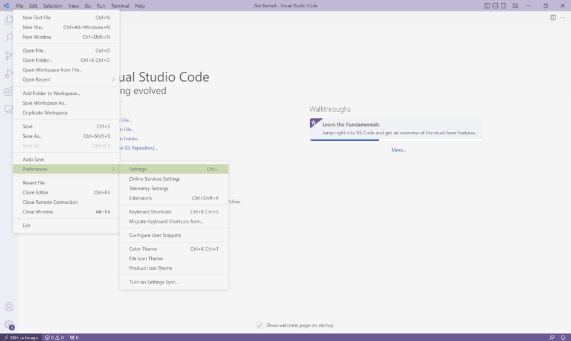
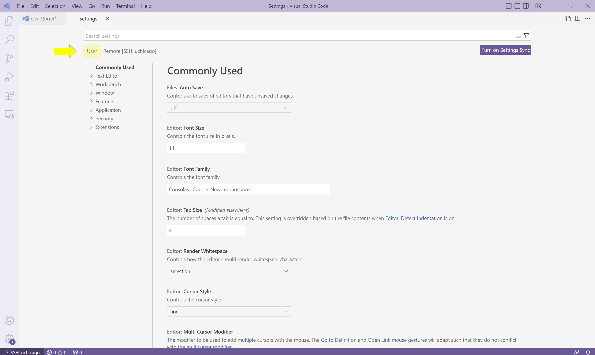
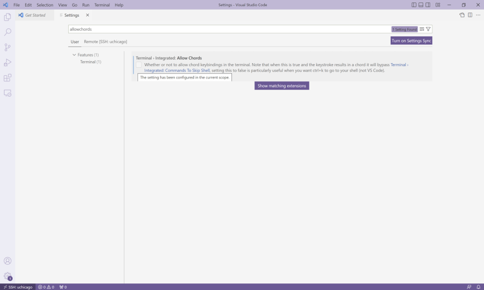

# Terminal Shortcuts

In this section, you will learn how to speed up terminal operations by chaining and auto-completing commands, iterating through previous commands, and erasing and jumping to different sections of command text.

## Chain Commands with `;`

It is often convenient to chain together commands that you want to run in sequence. For example, recall that to print the working directory and list all of the files and directories contained inside, you would use the following commands:

```bash
$ pwd
/home/username/
$ ls
Desktop  Documents  Downloads  Music  Pictures  Public  Templates  Videos
```

You could also run them together, like so:

```bash
$ pwd ; ls
/home/username/
Desktop  Documents  Downloads  Music  Pictures  Public  Templates  Videos
```

First, `pwd` is executed and run to completion, and then `ls` is executed and run to completion. The two examples above are thus equivalent, but the ability to run multiple commands together is a small convenience that could save you some time if there is a group of commands that you want to execute sequentially.

{: .note}
> The shell doesn’t care about white space, so it will run any of the following as well:
> 
> ```
> $ pwd;ls
> $ pwd ;ls
> $ pwd; ls
> $ pwd       ;        ls
> ```

## Auto-complete Commands with `tab`

It can be tedious (and, when you are tired, challenging) to spell directory or file names exactly, so the terminal provides an auto-complete mechanism to guide you through your folder explorations. To access this functionality, simply start typing whatever name you are interested in the context of a command and then hit tab. If there is only one way to finish that term hitting tab will fill in the rest of the term, for instance, if we typed `ls b` and then hit tab it would automatically finish the word `ls backups` and then await our hitting enter. If there is MORE than one way to finish a term, like if we had another folder called `backups-old`, then hitting tab twice will cause the terminal to display all of the options available.

Training yourself to use auto-completion (aka tab completion) will save you time and reduce the inevitable frustration that arises from mistyping file names when you are tired or distracted.

## Use Other Keyboard Shortcuts with `Ctrl`

Used at the Linux prompt, the keyboard shortcut `Ctrl-P` will roll back to the previous command. If you type `Ctrl-P` twice, you will roll back by two commands. If you type `Ctrl-P` too many times, you can use `Ctrl-N` to move forward. You can also use the arrow keys: up for previous (backward), down for next (forward).

Here are few more useful shortcuts:

- `Ctrl-A` will move you to the beginning of a line.

- `Ctrl-E` will move you to the end of a line.

- `Ctrl-U` will erase everything from where you are in a line back to the beginning.

- `Ctrl-K` will erase everything from where you are to the end of the line.

- `Ctrl-L` will clear the text from current terminal

As a caveat, Visual Studio Code's own preconfigured keyboard shortcuts frequently interfere with these commands.  To work around this:

1.  Navigate to "File > Preferences > Settings".



{:style="counter-reset:none"}  
2.  Click on the "User" tab and then search for "allowChords". 



{:style="counter-reset:none"}
3.  Uncheck the box for the option when it appears.



After you're done with the configuration changes, play around with these commands. Being able to scroll back to, edit, and then re-run previously used commands saves time and typing! And like auto-completion, getting in the habit of using keyboard shortcuts will reduce frustration as well save time.

{:style="text-align:center"}
[Previous](./6-io-streams.html){: .btn } [Next](./8-conclusion.html){: .btn }
