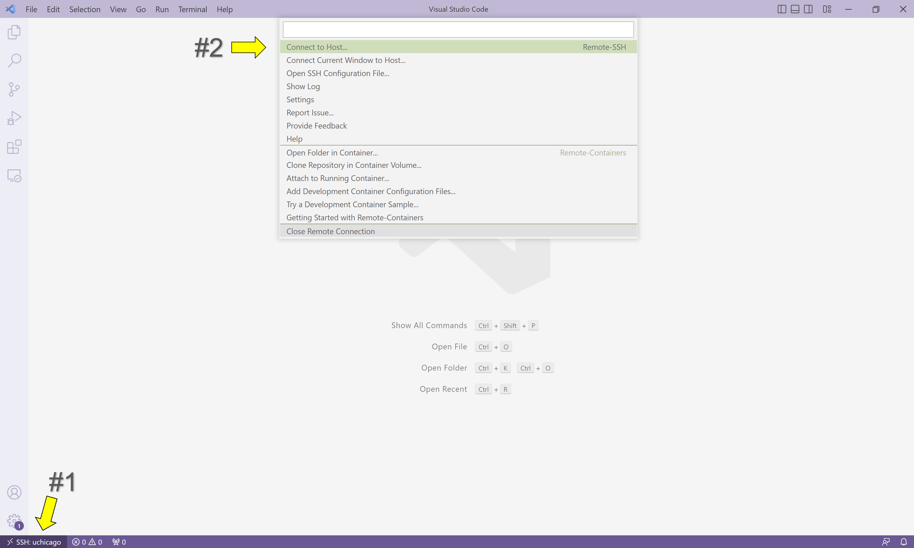

# Conclusion

Great work! At this point, you should be comfortable:

- Remotely connecting to your assigned server
- Browsing the Linux file system using list (`ls`) and change directory (`cd`)
- Viewing file contents with concatenate (`cat`)
- Looking up unknown commands with `man`
- Managing I/O streams with pipe (`|`), redirect (`<`, `>`), and append (`>>`)
- Filtering command outputs using wildcards (`*`) and global regular expession print (`grep`)
- Editing files in VS Code
- Running Python programs from the command line using `python3 <fileName>`
- Utilizing terminal shortcuts to boost productivity

You will have more opportunities to practice these skills during the camp and throughout CAPP 30121.

As a final note, sometimes a program will run indefinitely or misbehave. When this happens, you can type `Ctrl-C` to send an interrupt signal to the running program, which usually causes it to terminate. On occasion, you may need to type `Ctrl-C` a few times. As noted earlier, typing `Ctrl-D` sends an end-of-input signal, which tells the program that no more information is coming.

## Close Your Remote Connection

Safely close your remote connection by clicking the button in the bottom lefthand corner of the screen and then selecting the option "Close Remote Connection" in the menu that appears.  VS Code will then direct you to an empty window with no folder open, which you can close.

## Next Steps

Our next two labs will focus on Git, the most commonly used software for tracking changes made to files (also known as _version control_). We'll dive into why Git is helpful for programmers, the commands you'll use to submit coding assignments for CAPP 30121, and the web platform we'll use to host code and view file changes over time (GitHub). See you then!

## Additional Resources

_Linux File System_

**"Course overview + the shell."** _The Missing Semester of Your CS Education_. MIT, 2020. [[Link](https://missing.csail.mit.edu/2020/course-shell/)]

This lecture provides a great overview of the difference between terminals and shells, how to navigate Unix-like file systems like Linux, and how to redirect output between programs. Other subjects in the course are advanced and beyond the scope of 30121.

**"The Linux command line for beginners."** _Ubuntu_. [[Link](https://ubuntu.com/tutorials/command-line-for-beginners#1-overview)]

This official tutorial from Ubuntu, a [distribution of Linux](https://en.wikipedia.org/wiki/Linux_distribution), covers how to create, move, and manipulate files and directories while addressing additional topics like user permissions and hidden files.

_Visual Studio Code_

**"Introductory Videos."** _Visual Studio Code_. Microsoft. [[Link]()]

This short video series walks through the basics of VS Code, including how to edit and run code, use keyboard shortcuts, download extensions, and more.  Some of these topics will be covered in future CAPP camp sessions.

{:style="text-align:center"}
[Next Lab](../s2-git-i/index.html){: .btn }
