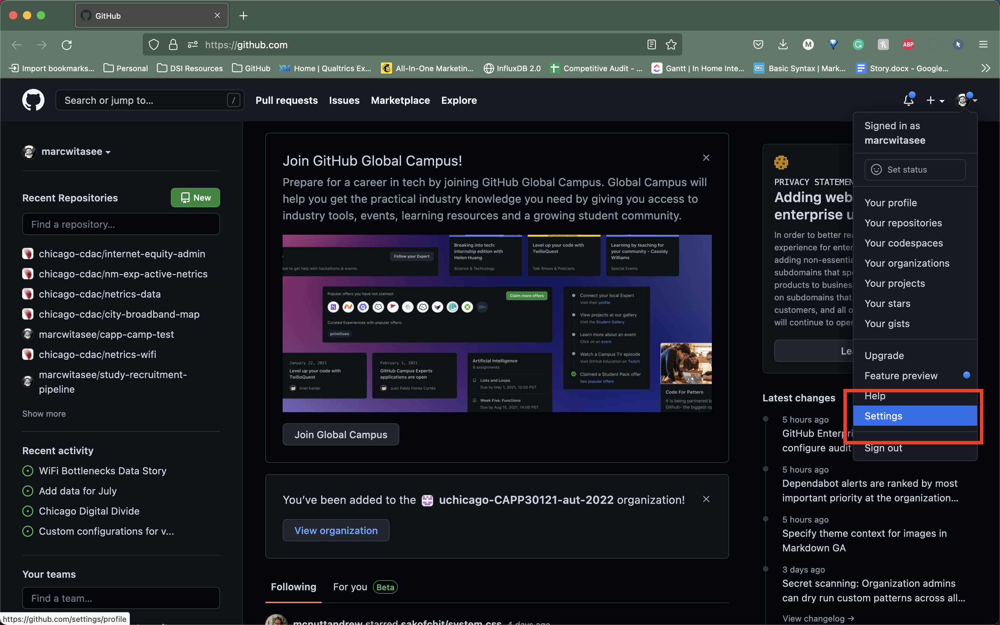
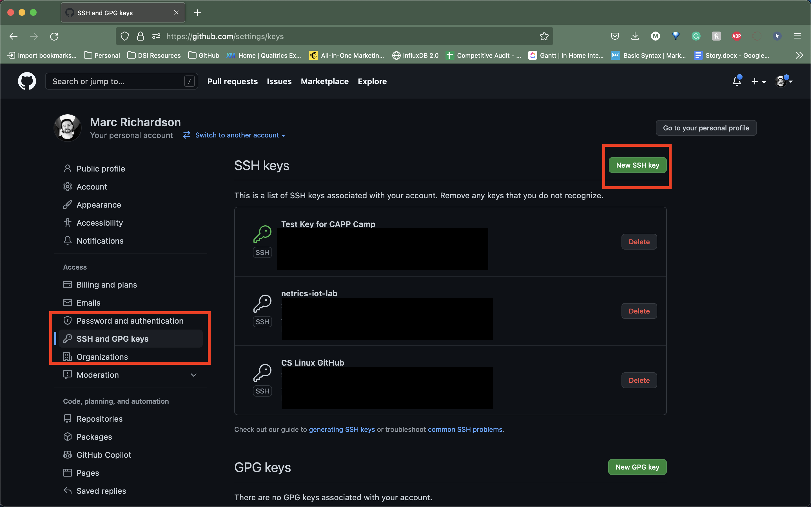
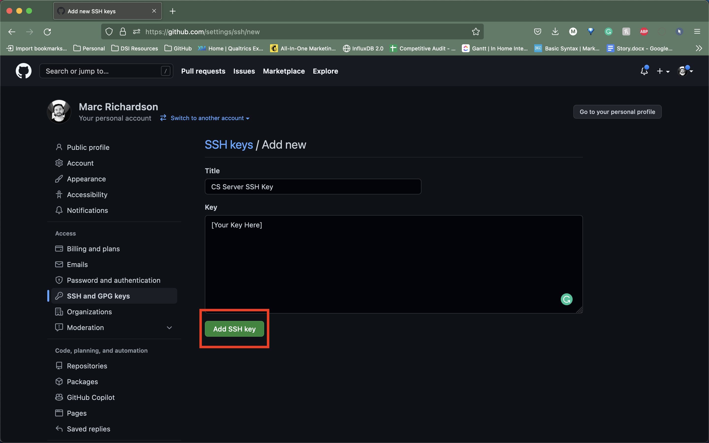

# Getting started

We have supplied [a URL on Canvas](https://canvas.uchicago.edu/courses/50967/modules) under the **Workshop 2 - Introduction to Git** that you will need as you work through this lab. Please open a browser and log into the Canvas CAPP Camp site to have access to this link.

For each assignment, a Git repository will be created for you on [GitHub](https://github.com/), a web-based hosting service for Git repositories. However, before that repository can be created for you, you need to have a GitHub account. If you do not yet have one, you can get an account here: [https://github.com/join](https://github.com/join).

{: .tip}
Once you create your account, you may want to get the [Student Developer Pack](https://education.github.com/pack), which will give you access to a lot of other features (Please note that having the Student Developer Pack is not necessary for CAPP 30121; it’s just a nice benefit you get as a student.)

## Joining the uchicago-capp-camp-2023 organization

We will be using GitHub Classroom and have created a GitHub organization (`uchicago-capp-camp-2023`) for the course (a GitHub “organization” is basically a way to group together related repositories). You should have received an email to your UChicago email account with an invitation to join the organization. If you have already accepted the invitation, then you can move on to the next section. If you have not accepted the invitation, please locate the invitation email in your UChicago email account and follow the instructions.

## Using Git with SSH

When you log into the GitHub website, you will use the username and password associated with your GitHub account. However, when using Git commands from the terminal, things are a bit different. In particular, GitHub uses two mechanisms for authenticating yourself from the terminal: Personal Access Tokens and SSH Keys. We will use SSH keys to authenticate from the terminal. This section contains the information necessary to set up Git with SSH on the departmental Linux servers.

### Creating an SSH Key

In the Linux lab, you should have generated an SSH key on your personal computer to access the Linux servers hosted by the Computer Science department. We will skip the details of SSH keys for now, as you can go back and review the [Linux lab](../s1-linux/1-connect.html) if you need to refresh the concepts again. Here, we will be using the same general process.

We will generate a *new* SSH key to access GitHub servers from the CS Linux servers. Once you have logged in to your assigned Linux server, make sure you are in your home directory.

```
$ cd
$ pwd
/home/{CNET_ID}
```

{: .note}
When you see curly braces (`{}`) around characters in a code block, such as in the code block above (`{CNET_ID}`), you must replace the characters inside the braces with your own personal information. So, for example, if you are instructed in this lab to run the following command, `cd /home/{CNET_ID}`, and your CNET ID is jsmith1, then the actual command you should run is `cd /home/jsmith1`, NOT `cd /home/{CNET_ID}` or `cd /home/{jsmith1}`. You will see similar syntax used when we start working with Git (e.g., `git clone uchicago-capp-camp-2023/camp-1-{GITHUB_USERNAME}`). As with the CNET ID example, you will replace `{GITHUB_USERNAME}` with your own GitHub username.

As you did previously, to create an SSH key, run the following command from the Linux command-line:

```
$ ssh-keygen
```

You can use all the defaults for this process (e.g., for the naming of the identification file and location). Be sure to skip setting a passphrase for the key. If all goes well, you should see something like this:

```
Your identification has been saved in /home/username/.ssh/id_rsa
Your public key has been saved in /home/username/.ssh/id_rsa.pub
The key fingerprint is:
SHA256:cBUUs2FeMCIrBlTyv/PGpBtNz0v235zvLykpoWIOS9I username@machine
The key's randomart image is:
+---[RSA 3072]----+
| .+.. . ..@+.    |
|   +   o = *     |
|    + o . o      |
|   . o o         |
|      . S        |
|   .   +.o.      |
|  . E ++..=. . . |
|   o o+++o.oo oo.|
|    .oo+. ...o.+O|
+----[SHA256]-----+
```

This means your key was created correctly.

### Uploading your SSH key to GitHub

Now, we need to instruct GitHub to accept our SSH key. To do this, log into [GitHub](https://github.com/) and go to your Settings page (by clicking on the top-right account icon and selecting “Settings” in the drop-down menu). Then, click on “SSH and GPG keys” in the sidebar menu.



Now, click on the green “New SSH key” button. This will take you to a page where you can upload your SSH key. You will be asked for two values: a “Title” and the key itself. The title can be anything you want, but we suggest something like “CS Server SSH Key”.



The value of the key is contained in the `.ssh/id_rsa.pub` file in your home directory. To print out the contents of that file, we can just use the `cat` command, which we covered in the Linux tutorial:

```
$ cat ~/.ssh/id_rsa.pub
```

This will print a few lines of output starting with `ssh-rsa` and ending in something like `username@machine`. Copy the whole output to the clipboard; you can do this by clicking and dragging the mouse from the first character to the last character, and then pressing `Ctrl-Shift-C` (for PCs) or `Cmd-Shift-C` (for Macs). If neither of these commands work, try using your machine’s standard text copy and paste mechanism.

Paste the key into the “Key” field on the GitHub page. Then, click on the green “Add SSH Key” button.



To verify that you correctly uploaded the key, try running the following command from your terminal:

```
ssh -T git@github.com
```

You may see a message like this:

```
The authenticity of host 'github.com (...)' can't be established.
RSA key fingerprint is SHA256:nThbg6kXUpJWGl7E1IGOCspRomTxdCARLviKw6E5SY8.
Are you sure you want to continue connecting (yes/no[fingerprint])?
```

You can safely enter “yes” here. You should then see a message like this:

```
Hi username! You've successfully authenticated, but GitHub does
not provide shell access.
```

This means your SSH key is properly set up (don’t worry about the “does not provide shell access”; that is normal).

If you are unable to set up your SSH key, please make sure to ask for help.

{: .note}
If you would like to set up SSH access from your personal computer at a later time, GitHub provides some pretty detailed documentation on how to do this in a number of different operating systems: [Connecting to GitHub with SSH](https://docs.github.com/en/github/authenticating-to-github/connecting-to-github-with-ssh). Please note that we may not be able to assist you with SSH issues on your own computer.

{:style="text-align:center"}
[Previous](./index.html){: .btn } [Next](./2-first-repo.html){: .btn }
