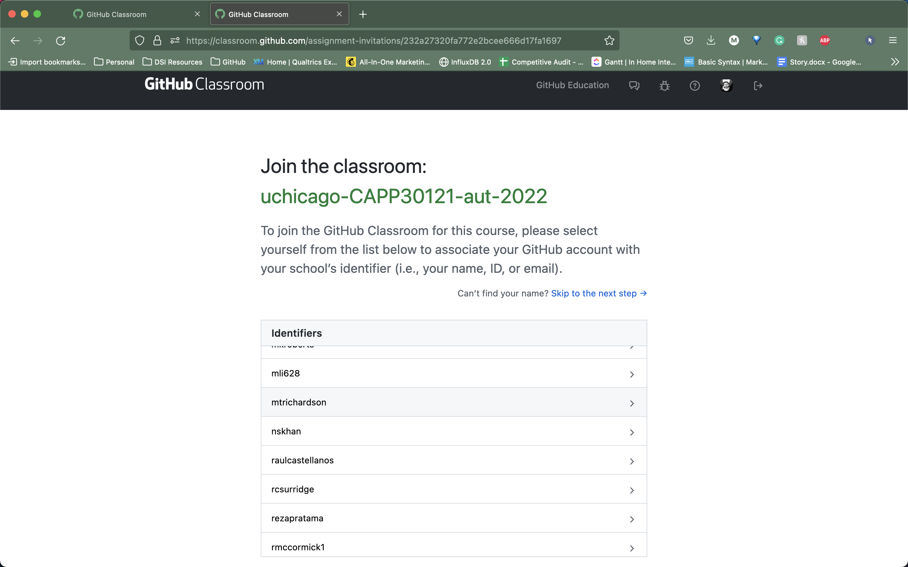
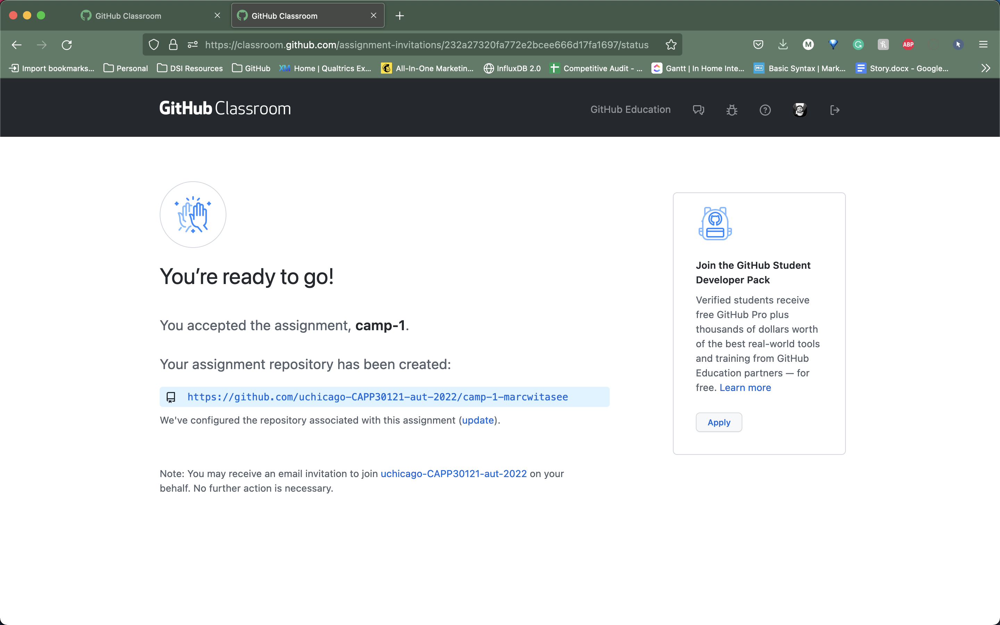
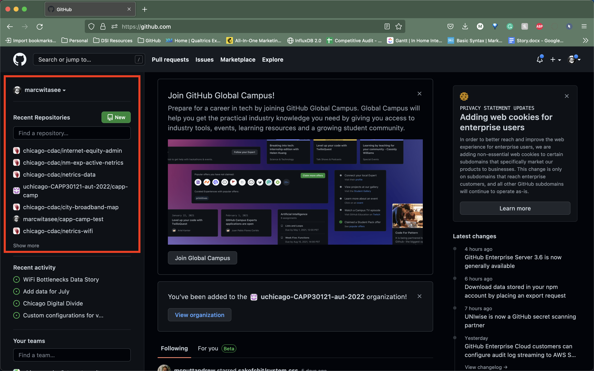

# Creating your first repository

For each assignment in CAPP 30121, we will provide you with an _invitation URL_ that will allow you to sign up for the assignment on GitHub and which will result in the creation of a repository called `XX-GITHUB_USERNAME` inside our `uchicago-capp-camp-2023` [organization](https://github.com/uchicago-capp-camp-2023). For example, if your GitHub username is `jrandom` and XX is `capp-camp`, your repository will be called `capp-camp-jrandom`. This repository will be private, and can be viewed only by you and the CAPP 30121 course staff.

## Accepting the GitHub Classroom assignment

For this lab, use the [Git I assignment URL](https://canvas.uchicago.edu/courses/50967/modules/items/2113117) that we published on Canvas. When you open the invitation URL in a browser tab, you will have to complete the following steps:

1.  You will need to select your UChicago email from a list. This step will allow us to know what student is associated with each GitHub account. This step is only done for the very first assignment invitation you accept.

   

{:style="counter-reset:none"}
1.  You must click “Accept this assignment” or your homework repository will not actually be created.

   

If you run into any issues, please ask for help.

## Initializing your repository

You will start by initializing your repository. Your repository is hosted on GitHub, but you can create a local copy in your home directory on the Linux servers (we will refer to this as your _local repository_).

Log into [GitHub](https://github.com/). Your homework repository, `uchicago-capp-camp-2023/git-i-{GITHUB_USERNAME}` should appear under “Recent Repositories” on the left side of the page. (If you don’t see a list of repositories on the left side of the page, try clicking on the GitHub Cat logo.)



Clicking on the repository's name will take you to a page where you can browse your repository through GitHub’s web interface. Since you haven’t initialized your repository yet, GitHub will provide you with instructions to initialize your repository. _You can ignore those instructions._ Instead, do the following:

 - Create a directory in your Linux home directory for CAPP 30121. The name and location of this directory is not important, so if you have a very strong preference for a different directory structure, you’re welcome to use it. Otherwise, we suggest you simply do this:

    ```
    cd
    mkdir -p capp30121/git-i-{GITHUB_USERNAME}
    cd capp30121/git-i-{GITHUB_USERNAME}
    ```

    replacing `{GITHUB_USERNAME}` with your actual GitHub username. (The `-p` flag to mkdir will create all the parent directories if needed; i.e., if you don’t already have a `capp30121` directory it will create one, and then will create a `git-i-{GITHUB_USERNAME}` directory inside it).

 - Navigate to the folder you just created, create a file called `README.md`, and add your full name to the file using an editor.
 
   {: .tip-title}
   >VSCode Tip
   >
   > You can create a new file using VSCode by running `code <filename>` in a terminal window that is the opened in appropriate directory. (Recall that the notation `<filename>` is a placeholder that should be replaced with an acutal filename.) For this specific task, you can use the command `code README.md`.
 
    {: .warning}
    > You must run the `code` command in a terminal window open in your VSCode application. If you run the `code` command from a standalone terminal window on your computer, you will get the following response:
    >
    > ```   
    > -bash: code: command not found
    > ```
    > 
    > If you see this output when attempting to run `code README.md`, you are in the wrong terminal and need to switch to a terminal in the VSCode application.
    >
    > To open a new terminal in VSCode, select “Terminal > New Terminal” on the Menu Bar. The terminal that appears will use the default shell (i.e., bash for Linux). You can see the terminal listed according to its shell name on the righthand side of the terminal panel.

 - Run the commands below replacing `{GITHUB_USERNAME}` in the fifth command with your GitHub username. We encourage you to run these commands one at a time and to only move on to the next command when you are sure the first one succeeded.

    ```         
    git init
    git add README.md
    git commit -m "first commit"
    git branch -M main
    git remote add origin git@github.com:uchicago-capp-camp-2023/git-i-{GITHUB_USERNAME}.git
    git push -u origin main
    ```

    Don’t worry about what each individual command does; we will be seeing what most of these commands do in this lab. If you encounter any error messages, please do make sure to let us know.

You can verify that your repository was correctly set up by going back to your repository’s page on GitHub, you should now see it contains a `README.md` file. If you click on it, you can see its contents.

{:style="text-align:center"}
[Previous](./1-getting-started.html){: .btn } [Next](./3-creating-a-commit.html){: .btn }
