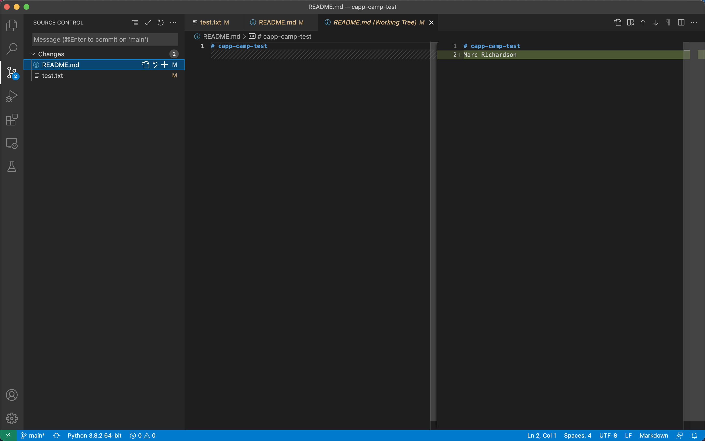

# Creating a commit

If you make changes to your repository, the way to store those changes (and the updated versions of the modified files) is by creating a _commit_. So, let’s start by making some changes:

- Edit `README.md` in VSCode to also include your CNetID on the same line as your name.
    
- Create a new file called `test.txt` (use `code test.txt`) that contains a single line with the text `Hello, world!`.

{: .tip-title} 
> VSCode Tip
>
> VSCode includes Git integrations which can be helpful for seeing what Git is doing without running Git commands from the terminal. While these integrations are convenient, **it is nonetheless important to understand how to use Git from the terminal**, as you will be a much stronger developer if you know how to work with Git without the aid of an Integrated Developer Environment (IDE).
>
> 
>
> If you look at your VSCode window, you will see on the left-hand sidebar an icon for Source Control. It should have a blue notification next to it. This notification tells us that we have two pending changes in our Git repository, because we modified `README.md` and created `test.txt`. If you click on the icon, you will see those two files listed under a grouping called "Changes." The Source Control menu can be useful for seeing which files you have modified or created since your last "checkpoint" in your Git repository.

## `git add` and `git commit`

**Creating a commit is a two-step process**. **First**, you have to indicate what files you want to include in your commit. Let’s say we want to create a commit that only includes the updated `README.md` file. We can specify this operation explicitly using the `git add` command from the terminal:

```
git add README.md
```

This command will not print any output if it is successful.

{: .tip-title}
> VSCode Tip
> 
> Now, if you click on the Source Control icon in VSCode, you will see that the `README.md` file has moved from the "Changes" grouping to a new grouping called "Staged Changes." VSCode is telling us that we have added the pending changes in `README.md` to a commit.

**Second**, you must create a commit from the files that you have added. To create the commit, use the `git commit` command. This command will take all the files you added with `git add` and will bundle them into a commit:

```
git commit -m "Updated README.md"
```

The text after the `-m` is a short message that describes the changes you have made since your last commit. Common examples of commit messages might be “Finished homework 1” or “Implemented insert function for data struct”.

Once you run the above command, you will see something like the following output:

```
[main 3e39c15] Updated README.md
 1 file changed, 1 insertion(+), 1 deletion(-)
```

{: .warning}
> If you forget the `-m` parameter, Git will think that you forgot to specify a commit message. It will graciously open up a default editor (nano) so that you can enter such a message. This can be useful if you want to enter a longer commit message (including multi-line messages).
>
> If you forgot the `-m` parameter in the above commit command, simply type `Updated README.md` at the top of the editor above the lines that begin with `#`. In nano, you can save the file and exit by pressing `Ctrl-X`, entering “Y” when prompted to “save modified buffer” (i.e., whether to save the file before exiting), and then pressing Enter (you may be presented with a new set of menu options; just press Enter). We will experiment with this default editor again in the next section.

{: .tip-title}
> VSCode Tip
> 
> Notice, now that we have created a commit with the pending changes to `README.md`, this file has disappeared from the Source Control interface and the blue notification next to the icon has decreased to 1. The only pending change in our Git repository is the addition of the new file `test.txt`.

## Publishing commits with `git push`

You’ve created a commit, but you’re not done yet: you haven’t uploaded it to GitHub yet. Forgetting this step is actually a very common pitfall, so don’t forget to upload your changes. You must use the `git push` command for your changes to be uploaded to the Git server. _If you don’t, the course staff will not be able to see your work_. Simply run the following command from the Linux command-line:

```
git push
```

You should see something like this output:

```
Enumerating objects: 5, done.
Counting objects: 100% (5/5), done.
Writing objects: 100% (3/3), 279 bytes | 279.00 KiB/s, done.
Total 3 (delta 0), reused 0 (delta 0)
To github.com:uchicago-capp-camp-2023/git-i-{GITHUB_USERNAME}.git
    392555e..0c85752  main -> main
```

You can ignore most of those messages. The important thing is to not see any warnings or error messages.

{: .warning} 
> When you push for the first time, you may get a message saying that `push.default is unset`, and suggesting two possible commands to remedy the situation. While the rest of the commands in this homework will work fine if you don’t run either of these commands, you should run the command to use “simple” (this will prevent the warning from appearing every time you push).

You can verify that your commit was correctly pushed to GitHub by going to your repository on the GitHub website. The `README.md` file should now show the updated content (your name and CNetID).

In general, if you’re concerned about whether the course staff are seeing the right version of your work, you can just go to GitHub. Whatever is shown on your repository’s page is what the course staff will see. If you wrote some code, and it doesn’t show up on GitHub, make sure you didn’t forget to add your files, create a commit, and push the most recent commit to the server.

{: .warning}
GIT I CHECKPOINT 1
**Before going to the next section of the lab, stop here and navigate to Gradescope to take our short quiz to review the concepts that we have covered so far in the lab.**
Link Here: https://www.gradescope.com/courses/570528/assignments

{:style="text-align:center"}
[Previous](./2-first-repo.html){: .btn } [Next](./4-commits-revisited.html){: .btn }
