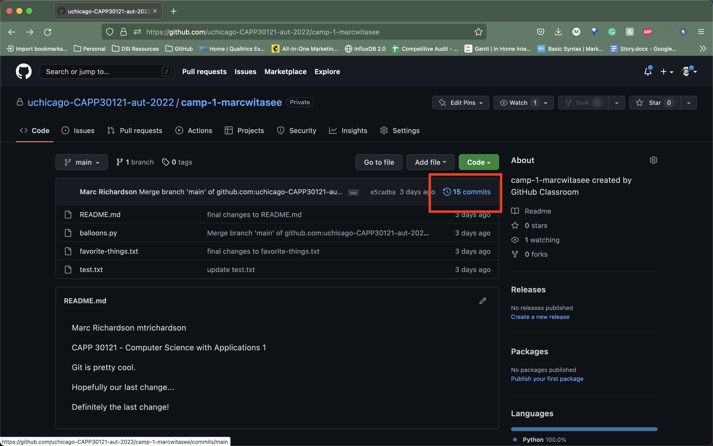

# `git add` revisited and `git status`

Let’s make a further change to `README.md`: Add a line with the text `CAPP 30121 - Computer Science with Applications 1`.

## Tracking vs untracked files

At this point, we have a file we have already committed (`README.md`) but where the _local_ version is now out of sync with the version on GitHub. Furthermore, earlier we created a `test.txt` file. Is it a part of our repository? You can use the following command to ask Git for a summary of the files it is tracking:

```
git status
```

This command should output something like this:

```
On branch main
Your branch is up to date with 'origin/main'.

Changes not staged for commit:
  (use "git add <file>..." to update what will be committed)
  (use "git restore <file>..." to discard changes in working directory)
        modified:   README.md
        
Untracked files:
  (use "git add <file>..." to include in what will be committed)
        test.txt

no changes added to commit (use "git add" and/or "git commit -a")
```

{: .note}
> When working on CS machines, you should see the message above. At some point, you will start using Git with your own machine. Depending on the version of Git you have installed, the message under `Changes not staged for commit` may refer to a command called `git checkout` (instead of `git restore`).

Notice that there are two types of files listed here:

- `Changes not staged for commit`: This is a list of files that Git knows about and have been modified since your last commit, but which have not been added to a commit (with `git add`). Note that we _did_ use `git add` previously with `README.md` (which is why Git is “tracking” that file), but we have not run `git add` since our last commit, which means the change we made to `README.md` is not currently scheduled to be included in any commit. Remember: **committing is a two-step process** (you `git add` the files that will be part of the commit, and then you create the commit (`git commit`)).
    
- `Untracked files`: This is a list of files that Git has found in the same directory as your repository, but which Git isn’t tracking.

{: .warning}
> You may see some automatically generated files in your Untracked files section. Files that start with a pound sign (#) or end with a tilde should _not_ be added to your repository. Files that end with a tilde are backup files created by some editors that are intended to help you restore your files if your computer crashes. In general, files that are automatically generated should not be committed to your repository. Other people should be able to generate their own versions, if necessary.

{: .tip-title}
> VSCode Tip
> 
> VSCode also tells you whether a file with pending changes belongs to the tracked-but-unstaged group or the untracked group. Notice in your VSCode window that the `README.md` file tab is light yellow with the character "M" next to it. VSCode is telling you that Git knows about this file and that it has been modified since your last commit. Conversely, the file tab for `test.txt` is bright green with the character "U" next to it, which indicates that this file is completely new to Git and is not currently being tracked.

## Staging changes with `git add`

Let’s go ahead and add `README.md`:

```
git add README.md
```

And re-run `git status`. You should see something like this:

```
On branch main
Your branch is up to date with 'origin/main'.

Changes to be committed:
  (use "git restore --staged <file>..." to unstage)
        modified:   README.md

Untracked files:
  (use "git add <file>..." to include in what will be committed)
        test.txt
```

{: .note}
When working on CS machines, you should see the message above. When using Git on your own machine and depending on the version of Git you have installed, the message under `Changes to be committed` may refer to a command called `git reset` (instead of `git restore`).

Notice how there is now a new category of files: `Changes to be committed`. Adding `README.md` not only added the file to your repository, it also staged it into the next commit (which, remember, won’t happen until you actually run `git commit`).

If we now add `test.txt`:

```
git add test.txt
```

The output of `git status` should now look like this:

    On branch main
    Your branch is up to date with 'origin/main'.
    
    Changes to be committed:
      (use "git restore --staged <file>..." to unstage)
            modified:   README.md
            new file:   test.txt

## Creating a commit with `git commit`

Now, we are going to create a commit with these changes. Notice how we are not going to use the `-m` parameter to `git commit`:

```
git commit
```

When you omit `-m`, Git will open a terminal text editor where you can write your commit message, including multi-line commit messages. By default, the CS machines will use [nano](https://www.nano-editor.org/) for this. You should see something like this:

```
# Please enter the commit message for your changes. Lines starting
# with '#' will be ignored, and an empty message aborts the commit.
#
# On branch main
# Your branch is up to date with 'origin/main'.
#
# Changes to be committed:
#       modified:   README.md
#       new file:   test.txt
```

Now, type in the following commit message above the lines that start with `#`:

```
CAPP Camp Lab 2 updates:

- Added test.txt
- Updated README.md file
```

In nano, you can save the file and exit by pressing `Ctrl-X`, entering “Y” when prompted to “save modified buffer” (i.e., whether to save the file before exiting), and then pressing Enter (you may be presented with a new set of menu options; just press Enter).

This will complete the commit, and you will see a message like this:

```
[main 1810c54] CAPP Camp Lab 2 updates:
 2 files changed, 4 insertions(+), 1 deletion(-)
 create mode 100644 test.txt
```

{: .note}
> If you want to change your default command-line editor, add a line like this:
> 
>     export EDITOR=myfavoriteeditor
> 
> at the end of the `.bashrc` file in your home directory (make sure you replace `myfavoriteeditor` with the command for your favorite command-line editor: `vi`, `emacs`, `nano`, `mcedit`, etc.).

## `git add` shortcuts

Now, edit `README.md` and `test.txt` to add an extra line to each of them with the text `Git is pretty cool`. Running `git status` should now show the following:

```
On branch main
Your branch is ahead of 'origin/main' by 1 commit.
  (use "git push" to publish your local commits)

Changes not staged for commit:
  (use "git add <file>..." to update what will be committed)
  (use "git restore <file>..." to discard changes in working directory)
        modified:   README.md
        modified:   test.txt
    
no changes added to commit (use "git add" and/or "git commit -a")
```

If we want to create a commit with these changes, we could simply run `git add README.md test.txt`, but this can get cumbersome if we want to add a lot of files. Fortunately, we can also do this:

```
git add -u
```

This command will add every file that Git is tracking, and will ignore untracked files. There are a few other shortcuts for adding multiple files, like `git add .` and `git add --all`, but we strongly suggest you avoid them, since they can result in adding files you did not intend to add to your repository.

So, if you run `git add -u` and create a commit:

```
git commit -m "A few more changes"
```

`git status` will now show this:

```
On branch main
Your branch is ahead of 'origin/main' by 2 commits.
  (use "git push" to publish your local commits)

nothing to commit, working tree clean
```

## Syncing commits with GitHub using `git push`

The message `Your branch is ahead of 'origin/main' by 2 commits.` is telling you that your local repository contains two commits that have not yet been uploaded to GitHub. In fact, if you go to your repository on the GitHub website, you’ll see that the two commits we just created are nowhere to be seen. As helpfully pointed out by the above output, all we need to do is run `git push`, which should show something like this:

```
Enumerating objects: 10, done.
Counting objects: 100% (10/10), done.
Delta compression using up to 16 threads
Compressing objects: 100% (6/6), done.
Writing objects: 100% (8/8), 728 bytes | 728.00 KiB/s, done.
Total 8 (delta 1), reused 0 (delta 0)
remote: Resolving deltas: 100% (1/1), done.
To github.com:uchicago-capp-camp-2023/camp-1-GITHUB_USERNAME.git
    0c85752..e3f9ef1  main -> main
```

Now go to GitHub. Do you see the updates in your repository? Click on “Commits” (above the file listing in your repository). If you click on the individual commits, you will be able to see the exact changes that were included in each commit.



Now, `git status` will look like this:

```
On branch main
Your branch is up to date with 'origin/main'.

nothing to commit, working tree clean
```

If you see `nothing to commit, working tree clean`, that means that there are no changes in your local repository since the last commit you created (and, additionally, the above output also tells us that all our commits have also been uploaded to GitHub).

{:style="text-align:center"}
[Previous](./3-creating-a-commit.html){: .btn } [Next](./5-discarding-changes-unstaging.html){: .btn }
