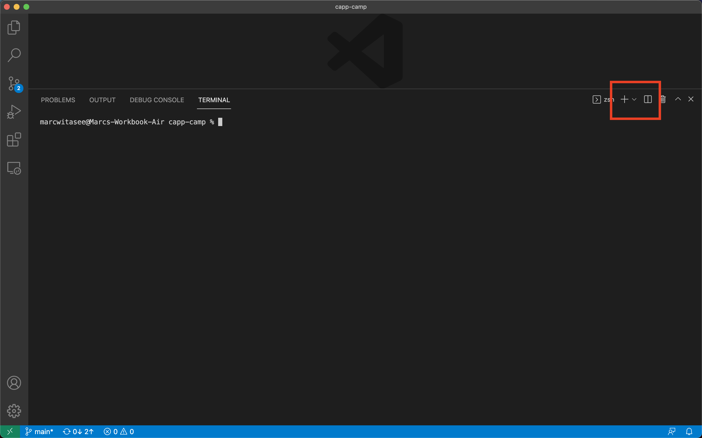
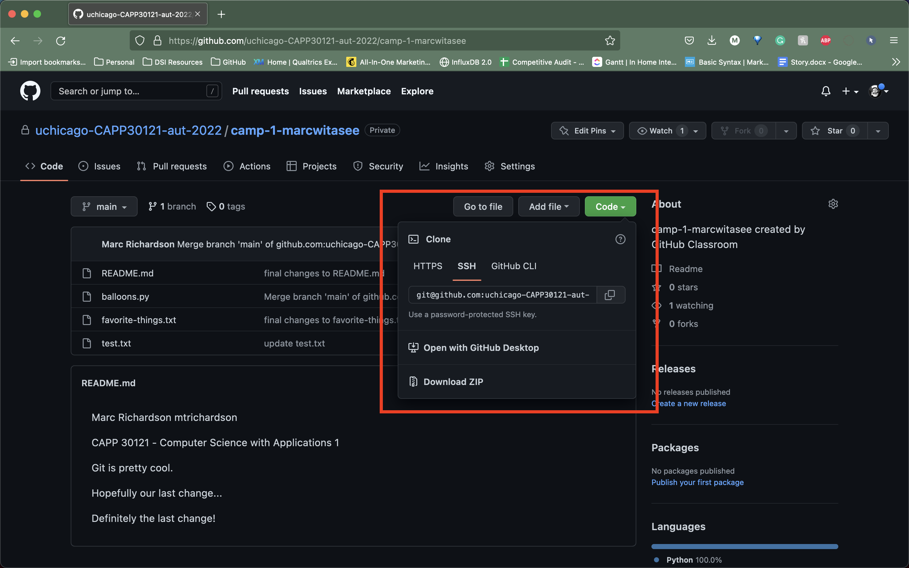

# Working from multiple locations

In the [first Git lab](../s2-git-i/index.html), you created a local repository in your CS home directory on the Linux servers, which you have been syncing to GitHub using the `git push` command. However, if you work from multiple locations (e.g., on a CS machine in JCL but also from your laptop), you will need to be able to create a local repository in other locations too.

## Using `git clone`

A common way of copying an existing repository from GitHub is by running the `git clone` command (**don’t run this command just yet**):

```
git clone git@github.com:uchicago-capp-camp-2023/camp-1-YOUR_GITHUB_USERNAME.git
```

This Git command will create a local repository that “clones” the version of the repository that is currently stored on GitHub.

For the purposes of this lab, we’ll create this second copy in a separate directory of the Linux server where you’ve been running Git commands so far. Open two terminal windows in VSCode.

{: .tip-title }
> VS Code Tip
>
> To open two terminal windows in VS Code, you can do the following:
> 1. To open the first terminal window, go to the "Terminal" tab on the VS Code menu bar at the top of the window and click on "New Terminal."
> 1. To open a second window, either click on the `+` icon that appears to the right of the terminal window that you just opened or click on the button that appears immediately to the right of the `+` icon to split the terminal window into two windows.
> 
> 

Navigate to your `camp-1-YOUR_GITHUB_USERNAME` directory in one terminal window (recall that you can navigate to your home directory just by running `cd`) and run these commands in the second window:

```
mkdir -p /tmp/$USER/capp30121
cd /tmp/$USER/capp30121
git clone git@github.com:uchicago-capp-camp-2023/camp-1-YOUR_GITHUB_USERNAME.git
```

**Be sure** to replace YOUR_GITHUB_USERNAME with your actual GitHub username before running the `git clone` command. (FYI: `$USER` is a bash environment variable that is set automatically to your user name. Bash will replace `$USER` in the command with your CS login.)

Take into account that, when you run `git clone`, the repository is not cloned _into_ the current directory. Instead, a _new_ directory (with the same name as the repository) will be created in the current directory, and you will need to `cd` into it to use Git commands for that repository.

{: .note}
> When you are cloning a Git repository, you will need to supply a URL that tells Git where to find the repository that you want to copy on GitHub's servers. In the `git clone` command that you just ran above, this URL is
> 
> ```
> git@github.com:uchicago-capp-camp-2023/camp-1-GITHUB_USERNAME.git
> ```
>
> We use this specific URL because we have connected to GitHub using an SSH key (covered in the [first Git lab](../s2-git-i/1-getting-started.html#using-git-with-ssh)). However, there are other methods (i.e., HTTPS) that use slightly different URLs that you can reference to clone a repository. If you go to a repository on GitHub's website, you can find other URLs and the clone methods that they are used with by clicking on the green `Code` button at the top of the repository's home page.
>
> 

## Syncing Multiple Repositories with `git pull`

You now have two local copies of the repository: one in your home directory (`/home/USER/capp30121/camp-1-YOUR_GITHUB_USERNAME`), which we will refer to as your _home_ repository for now and one in `/tmp` (`/tmp/$USER/capp30121/camp-1-YOUR_GITHUB_USERNAME`) which we will refer to as your _temp_ repository.

To start, use one terminal to navigate to your home repository. Add a line to `test.txt` with the text `One more change!`. Create a commit for that change and push it to GitHub (you should know how to do this by now, but make sure to ask for help if you’re unsure of how to proceed). You don’t have to use any specific commit message (unlike previous steps where we gave you the exact message), but make sure your commit message is descriptive and to the point.

Next, use the second terminal to navigate to your temp repository (`cd /tmp/$USER/capp30121/camp-1-YOUR_GITHUB_USERNAME`). Check if your latest change appears in the `test.txt` file using the `cat` command. It will not, because you have not yet downloaded the latest commits from the GitHub repository. You can do this by running this command:

```
git pull
```

This should output something like this:

```
remote: Enumerating objects: 5, done.
remote: Counting objects: 100% (5/5), done.
remote: Compressing objects: 100% (2/2), done.
remote: Total 3 (delta 0), reused 3 (delta 0), pack-reused 0
Unpacking objects: 100% (3/3), 312 bytes | 20.00 KiB/s, done.
From github.com/uchicago-CAPP30121-aut-2021/camp-1-YOUR_GITHUB_USERNAME
   e3f9ef1..5716877  main       -> origin/main
Updating e3f9ef1..5716877
Fast-forward
 test.txt | 3 ++-
 1 file changed, 2 insertions(+), 1 deletion(-)
```

{: .note} 
> You might see a warning message at the beginning of the output after running `git pull` that looks like this:
> 
> ```
> # hint: Pulling without specifying how to reconcile divergent branches is
> # hint: discouraged. You can squelch this message by running one of the following
> # hint: commands sometime before your next pull:
> # hint: 
> # hint:   git config pull.rebase false  # merge (the default strategy)
> # hint:   git config pull.rebase true   # rebase
> # hint:   git config pull.ff only       # fast-forward only
> # hint: 
> # hint: You can replace "git config" with "git config --global" to set a default
> # hint: preference for all repositories. You can also pass --rebase, --no-rebase,
> # hint: or --ff-only on the command line to override the configured default per
> # hint: invocation.
> ```
>
> As the message suggests, Git discourages merging branches (in this case, your `main` branch and your remote `origin/main` branch) without specifying a process for combining them into one. We won't get into the details of branches and different merge strategies here; all you need to know is that this message does not signify that `git pull` failed. If you want to turn off this warning, you can run
> 
> ```
> git config pull.rebase false
> ```

If you have multiple local repositories (e.g., one on a CS machine and one on your laptop), it is *very* important that you remember to run `git pull` before you start working, and that you `git push` any changes you make. Otherwise, your local repositories (and the repository on GitHub) may _diverge_ leading to a messy situation called a _merge conflict_ (we discuss conflicts in more detail below). This will be especially important once you start using Git for its intended purpose: to collaborate with multiple developers, where each developer will have their own local repository, and it will become easier for some developers’ code to diverge from others’.

{:style="text-align:center"}
[Previous](./index.html){: .btn } [Next](./2-commit-log.html){: .btn }
