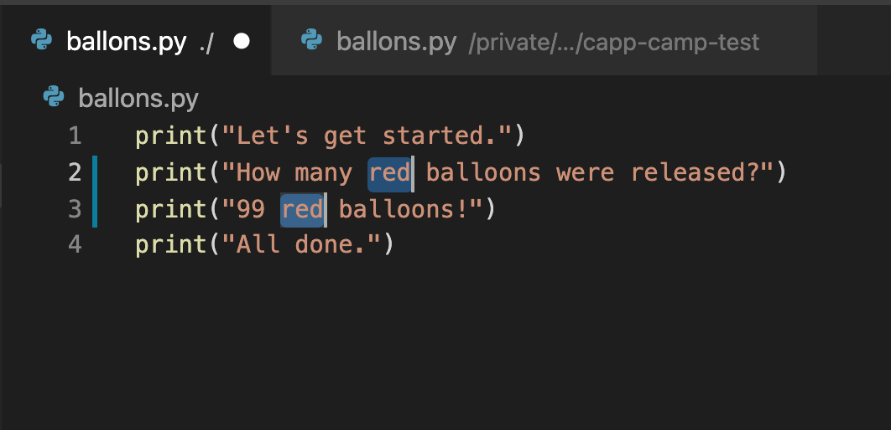
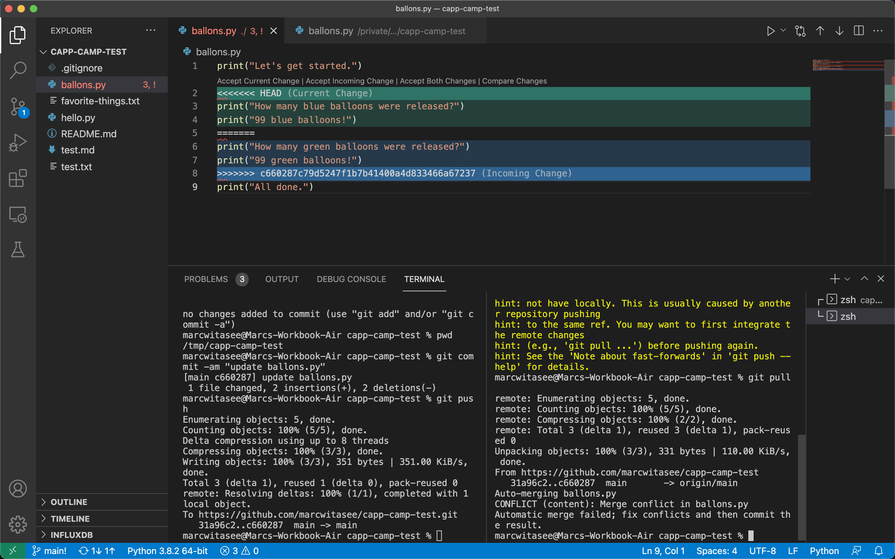

# Merge conflicts

If you have multiple copies of the same repository, it is easy for them to get out of sync. In this section, we will purposely create a merge conflict using the home and temp repositories that you have created to allow you to see how to fix conflicts. As in the section on working from multiple locations, you’ll want to have two terminal windows open for this section: one where you’ll work with your home repository (that is, the copy of the repository in your home directory) and the other where you’ll work with your temp repository (the one in `/tmp/$USER/capp30121/`).

First, let’s add a file to your home repository. Use `pwd` to make sure you are in the right local repository:

```
$ pwd
/home/{USER}/capp30121/git-i-{GITHUB_USERNAME}
```

(`{USER}` should be your CNetID.) If the result of `pwd` starts with `/tmp` then you are in the wrong window and should switch to the correct one before proceeding.

Now, in your home repository, create a file named `balloons.py` (`code balloons.py`) that contains these four lines of Python code:

```
print("Let's get started.")
print("How many red balloons were released?")
print("99 red balloons!")
print("All done.")
```

Now commit and push this code to GitHub.

Switch to the window open to the temp copy of your repository and run `ls`. Do see `balloons.py`? No. Why? Because the temp copy of the repository is out of sync with GitHub. Run:

```
git pull
```

to get it back in sync.

## Generating a Merge Conflict

To create a merge conflict, we need to edit files in different and conflicting ways. In the temp copy of the repository, open `balloons.py` in the VSCode editor and replace both occurrences of `red` with `green` in `balloons.py`, as below:

```
print("Let's get started.")
print("How many green balloons were released?")
print("99 green balloons!")
print("All done.")
```

{: .tip-title}
> **VSCode Tip**
> 
> In VSCode, there is a simple keyboard shortcut that allows you to edit multiples lines of text simultaneously. This shortcut is useful when you need to make a repetitive change to multiples lines in a file, as we are doing here.
> 
> Highlight the text `red` in the file. Press `Ctrl+D` (PC) or `Cmd+D` (Mac). We now have two cursors from which we can modify text simultaneously. Type `green` and press the `esc` key to return to one cursor.
>
> 
> 
> You can use this command to add as many selections as there are in the file and edit them all in one go. If we had three instances of `red` in our file, then pressing the command twice would create three cursors and edit all three instances at the same time.

Now, in your temp repository, commit and push `balloons.py` to GitHub.

Switch back to the home copy of your repository (`/home/USER/capp30121/git-i-{GITHUB_USERNAME}`). The home copy is out of sync with the server and the temp copy, but do **not** pull from the server to sync them up just yet. Instead, change `red` to `blue` in `balloons.py`:

```
print("Let's get started.")
print("How many blue balloons were released?")
print("99 blue balloons!")
print("All done.")
```

and then add and commit the file to this copy of your repository. If you try to push to GitHub at this point, you’ll see a message like this:

```
$ git push
To https://github.com/uchicago-capp-camp-2023/git-i-{GITHUB_USERNAME}.git
 ! [rejected]        main -> main (fetch first)
error: failed to push some refs to 'https://github.com/uchicago-capp-camp-2023/git-i-{GITHUB_USERNAME}.git'
hint: Updates were rejected because the remote contains work that you do
hint: not have locally. This is usually caused by another repository pushing
hint: to the same ref. You may want to first integrate the remote changes
hint: (e.g., 'git pull ...') before pushing again.
hint: See the 'Note about fast-forwards' in 'git push --help' for details.
```

The hint says to do a `git pull`, let’s try that:

```
$ git pull
remote: Enumerating objects: 5, done.
remote: Counting objects: 100% (5/5), done.
remote: Compressing objects: 100% (2/2), done.
remote: Total 3 (delta 1), reused 3 (delta 1), pack-reused 0
Unpacking objects: 100% (3/3), 343 bytes | 114.00 KiB/s, done.
From https://github.com/uchicago-capp-camp-2023/git-i-{GITHUB_USERNAME}.git
   4d2b54c..f4a73be  main       -> origin/main
Auto-merging balloons.py
CONFLICT (content): Merge conflict in balloons.py
Automatic merge failed; fix conflicts and then commit the result.
```

Git recorded the conflicts in `balloons.py`, the conflicts being that one commit changes `red` to `green` and another commit changes `red` to `blue`. Git does not know how to merge these conflicting changes by itself. Should the ballons be `green` or `blue`? Because it cannot merge the two changes without negating one, git relies on us to resolve the conflict before we can continue updating the file further and committing those changes to our remote repository. We will walkthrough how to resolve the merge conflict below.

## Resolving a Merge Conflict

`balloons.py` is a small file, so we can use `cat` to look at the contents:

```
$ cat balloons.py
print("Let's get started.")
<<<<<<< HEAD
print("How many blue balloons were released?")
print("99 blue balloons!")
=======
print("How many green balloons were released?")
print("99 green balloons!")
>>>>>>> f4a73bedf23e07daf75baa048defbca0d9ae72cb
print("All done.")
```

The long number `f4a73bedf23e07daf75baa048defbca0d9ae72cb` is the SHA for the commit that you pushed from the temp repository which Git just tried to merge automatically with the home repository's version of `balloons.py`. You’ll see a different SHA there. The code that appears between the line `>>>>>>> f4a73bed...` and the line `=======` is the last commit that you pulled from GitHub (changing the balloon color from red to green). The code that appears between the line `<<<<<<< HEAD` and the line `=======` is the code that you just committed locally in your home repository (changing the balloon color from red to blue).

{: .tip-title}
> **VSCode Tip**
> 
> The Git integration with VSCode will also show you visual information when there is a merge conflict with one of your files. If you look at `balloons.py` file in your home directory in your VSCode editor, you will see the same content that you see when you `cat` the file, along with some additional information that VSCode provides.
> 
> 
>
> VSCode will highlight in green the "Current Change" in the file and highlight in blue the "Incoming Change" in the file. The other thing to notice is that VSCode signals quite clearly that the file contains a merge conflict. Notice that the file tab at the top of the editor is now red with an `!` next to the file name. These visual indicators are another signal that the file has a merge conflict.

You can obtain more information about the merge conflict that you just generated using `git status`.

```
On branch main
Your branch and 'origin/main' have diverged,
and have 1 and 1 different commits each, respectively.
  (use "git pull" to merge the remote branch into yours)

You have unmerged paths.
  (fix conflicts and run "git commit")
  (use "git merge --abort" to abort the merge)

Unmerged paths:
  (use "git add <file>..." to mark resolution)
	both modified:   balloons.py

no changes added to commit (use "git add" and/or "git commit -a")
```

The output from `git status` tells you that your `main` branch in the home repository has diverged from the `origin/main` branch in your remote repository. It also identifies where the divergence has occured and provides some instructions for how to resolve the merge conflict.

As indicated by `git status`, you need to resolve this conflict and remove the conflict markings (“<<<”, “===”, ">>>") by editing `balloons.py` where the merge conflict has occured. You then need to tell Git that it is resolved using `git add` and `git commit`. In some cases, resolving the conflict will just involve editing the file to keep the exact code in one of the two versions. However, we are not required to do so. For example, the developer handling this merge conflict may look at this code and decide that red is the right color for the balloons after all. In that case, we would just replace the conflict with this code:

```
print("How many red balloons were released?")
print("99 red balloons!")
```

Make this change to `balloons.py` in the VSCode editor; remove/update the relevant lines and save your changes. When you are done, the file `balloons.py` should contain the following:

```
print("Let's get started.")
print("How many red balloons were released?")
print("99 red balloons!")
print("All done.")
```

Now, we need to tell Git that we’ve resolved the merge conflict. We do this by using `git add`:

```
git add balloon.py
```

Note how now `git status` recognizes that the merge conflict has been resolved, but has yet to be committed:

```
$ git status
On branch main
Your branch and 'origin/main' have diverged,
and have 1 and 1 different commits each, respectively.
  (use "git pull" to merge the remote branch into yours)

All conflicts fixed but you are still merging.
  (use "git commit" to conclude merge)

Changes to be committed:
	    modified:   ballons.py
```

So, all we need to do is to run this command:

```
git commit
```

which will open up an editor with a default commit message like:

```
Merge branch 'main' of https://github.com/uchicago-capp-camp-2023/git-i-{GITHUB_USERNAME} into main
```

You could change this to something like `Merging (balloons should actually be red)` to indicate that you did not actually accept the changes from either version. For now you can leave it as it and just save the default commit message (`Ctrl+X`). Once you save the commit message, the merge will be completed and you will see something like this:

```
[main 8e0f408] Merge branch 'main' of https://github.com/uchicago-capp-camp-2023/git-i-{GITHUB_USERNAME} into main
```

That is the _merge commit_ for this merge; if you run `git log`, you will see that the commit history now includes the commit that you created in the temp repository (`f4a73bedf23e07daf75baa048defbca0d9ae72cb`) and the commit that you created in the home repository (`a92cbc869c282f8dbc78656469981c407962299f`), as well as the merge commit (`2fd85a9e7d4da0caf7fd97af18aacd40175f32d1`). Notice how the merge commit includes a `Merge:` line referencing the respective SHAs of the two commits that were merged:

```
$ git log
commit 2fd85a9e7d4da0caf7fd97af18aacd40175f32d1 (HEAD -> main)
Merge: a92cbc8 f4a73be
Author: USER <USER_EMAIL>
Date:   Sat Aug 6 12:38:20 2022 -0500

    Merge branch 'main' of https://github.com/uchicago-capp-camp-2023/git-i-{GITHUB_USERNAME} into main

commit a92cbc869c282f8dbc78656469981c407962299f
Author: USER <USER_EMAIL>
Date:   Sat Aug 6 12:10:41 2022 -0500

    change red balloons to blue balloons in balloons.py

commit f4a73bedf23e07daf75baa048defbca0d9ae72cb (origin/main)
Author: USER <USER_EMAIL>
Date:   Sat Aug 6 12:08:03 2022 -0500

    change red balloons to green balloons in balloons.py

commit 4d2b54c1adf4131ef151f07d604ee6f777fb8bbd
Author: USER <USER_EMAIL>
Date:   Sat Aug 6 11:53:08 2022 -0500

    add balloons.py
```

Now, `git status` will reflect that we have both resolved the merge conflict and committed the fix to Git.

```
On branch main
Your branch is ahead of 'origin/main' by 2 commits.
  (use "git push" to publish your local commits)

nothing to commit, working tree clean
```

Before continuing with the rest of the lab, make sure to `git push` your work. You should also run `git pull` in your temp repository to bring it up to date with the server.

## Wrapping Up Merge Conflicts

To sum up this section of the lab, let's reflect on what we did.

We generated a merge conflict by editing `balloons.py` in the home and temp repositories to create a divergence in the file (changing the red balloons to green in temp and changing the red balloons to blue in the home repository). When we tried to sync the changes from the temp repository with the changes from our home repository, Git tried and failed to merge these divergent changes automatically. It then prompted us to resolve the divergence manually by deciding which changes we wanted to keep (or remove them both and replace them with something different). We then fixed the divergence by editing the file, deciding how to resolve the conflict, and notifying Git of our decision by adding our fix to a new merge commit.

The main thing to take away from this exercise is that merge conflicts, while they can be confusing and messy, are not anything to fear. Although the output generated by a merge conflict can be daunting, all you need to do is make a decision about how to resolve divergent files in your repository. Nonetheless, it is important to understand how to resolve merge conflicts, because they will prevent you from further updating your work on the remote repository. With this knowledge in hand, you should be able to go forward and handle merge conflicts with confidence.

This exercise also underscores the importance of using `git pull` to sync your local repository with the remote repository **before** beginning further work on an assignment, particularly if you are working from multiple locations. Note that, in the exercise above, if we had pulled the changes that we introduced from the temp repository to the home repository before editing `balloons.py` again, we would have avoided a merge conflict. (That is why we told you not to run `git pull` right away, for sake of illustration.) Syncing your local and remote repository with `git pull` at the beginning of a work session is a sound Git habit to pick up; it will save you a lot of time and headache from having to solve merge conflicts, which can be much messier and complex than the simple conflict that we practiced with above.

{:style="text-align:center"}
[Previous](./2-commit-log.html){: .btn } [Next](./4-upstream-repositories.html){: .btn }
