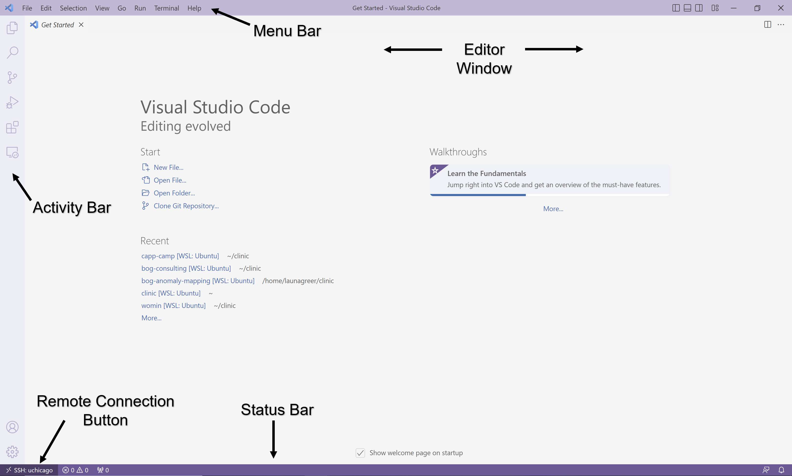
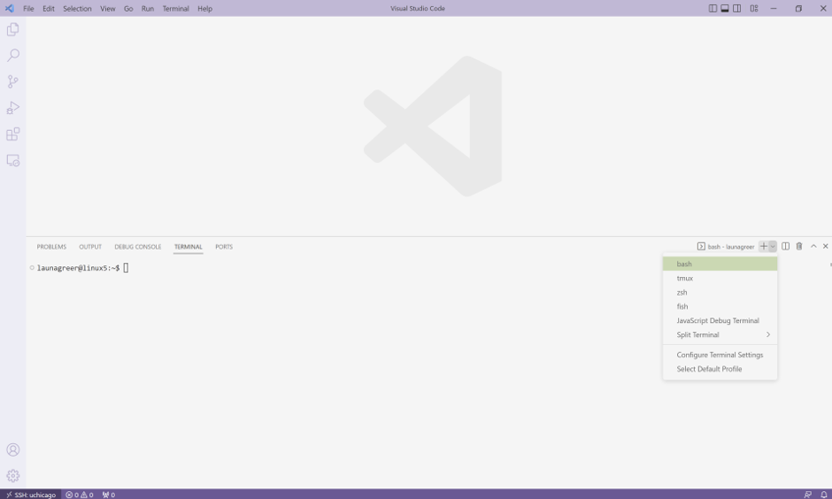
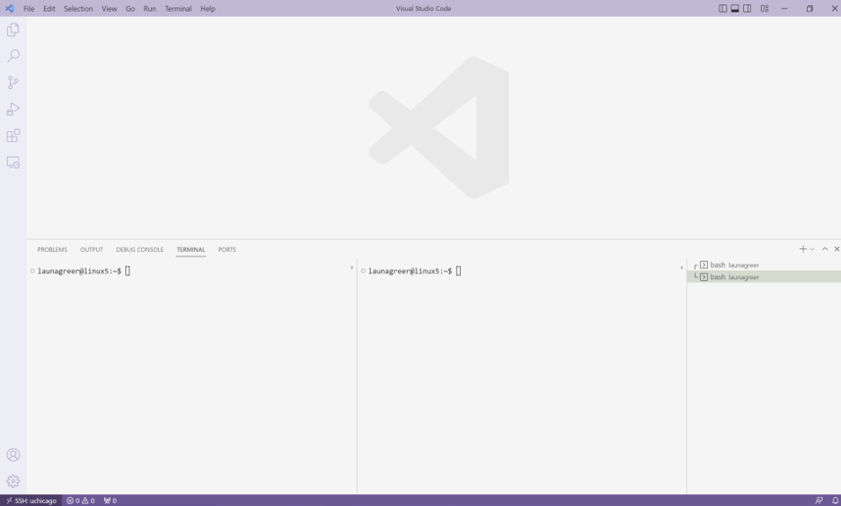
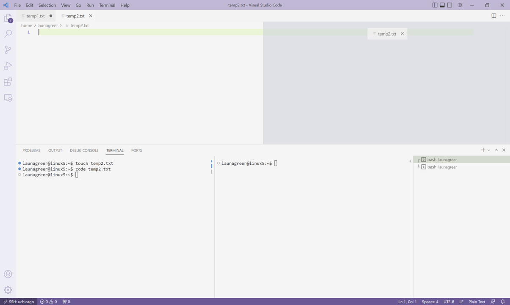
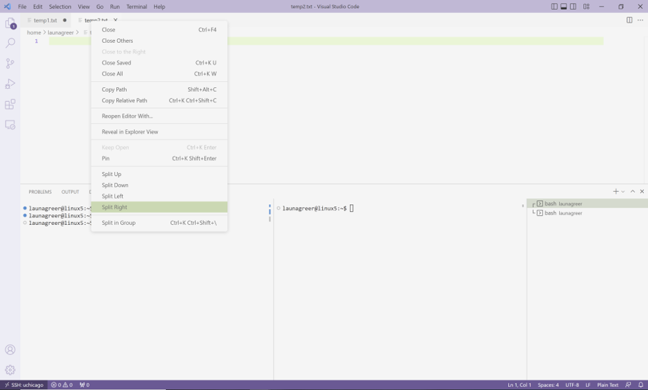
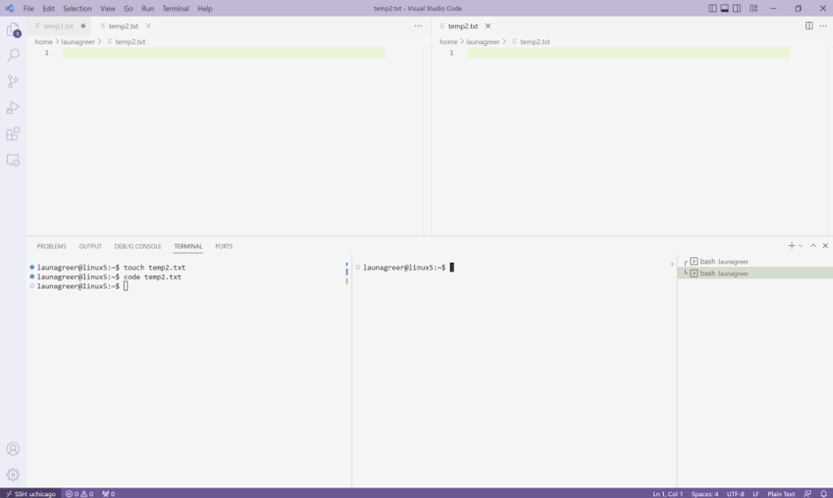
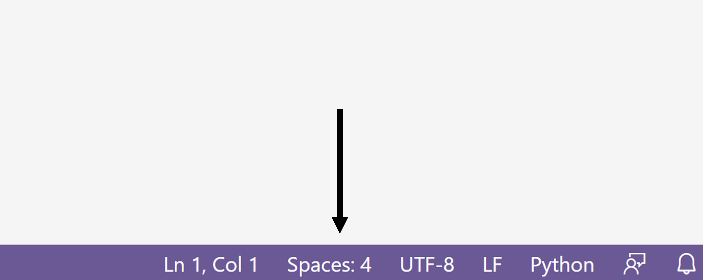

# VS Code for Python

Recall from the [first lab](../s1-linux/index.md) the main components of VS Code's graphical interface:



- **Editor**: The main section of the application, where files are edited. Defaults to a "Getting Started" file when you first launch the application if you haven't opened any files for editing yet.

- **Menu Bar**: The horizontal bar at the top of the application. Provides sub-menus allowing you to quickly open your workspace to a new file or folder, save files, and launch new terminals.

- **Activity Bar**: The vertical bar on the lefthand side of the application. Has buttons for file navigation, file search, Git source control, debugging, and extensions, among others.

- **Status Bar**: The horizontal bar at the bottom of the application. Shows the number of current code warnings and errors as well as the line number and file type of the file that is currently active in the Editor.

- **Terminal**: A panel that opens underneath or to the side of the Editor. Defaults to the `bash` shell. Allows you to navigate folder directories and execute commands.

In this section, we'll dive deeper into general features of VS Code and the Python extension that allow us to program in Python more efficiently and have the opportunity to adjust some of our configuration settings ahead of CAPP 30121. Let's get started!


## Changing Application Appearance

One set of useful features involves modifying VS Code's default appearance for increased productivity and accessibility. Users can create and reposition multiple terminals and editor tabs, zoom in and out, and set custom color themes.

{: .note}
For more ways of configuring VS Code for greater accessiblity, please visit [this page](https://code.visualstudio.com/docs/editor/accessibility) on the official website.

### Terminals

To open a new terminal, select "Terminal > New Terminal" on the Menu Bar.  The terminal that appears will use the default shell (i.e., `bash` for Linux). You can see the terminal listed according to its shell name on the righthand side of the terminal panel.

In the future, you might want to use multiple terminals simultaneously, perhaps even of different shells. Try out this feature by clicking the "+" button on the righthand side of the terminal to open another terminal with the default shell type. Then click the dropdown arrow next to the "+" button to open a new terminal with a specific shell type. As you add new terminals, their names also appear in the righthand panel.



VS Code also allows users to split one terminal into multiple views. To test this feature, right click one of the terminals you have created and select "Split Terminal". Now two terminals are open to the same directory, and their names have a connection line drawn between them.



To remove terminals, simply hover over their name and click the trash can icon that appears.  When all terminals are gone, the terminal panel disappears so only the editor is displayed. To toggle the terminal panel open and closed so it is displayed or  hidden, you can use the shortcut `Ctrl+```.  If no terminals exist when the terminal panel is toggled open, a new terminal open to the default shell is created.

### Editor Tabs

As we discussed in the first lab, you can open a new file in VS Code's Editor by running the keyboard shortcut `code <filename>` in the terminal. To use VS Code's interface to browse the contents of directories, open the workspace folder you'd like to see. You can then select a file manually through the Explorer Menu on the Activity Bar or by using `Ctrl-P` and searching for the file in the workspace.

To view two files side by side, simply drag and drop the file tabs to a desired position in the Editor window. You'll see highlighted options available (i.e., right side, left side, top, bottom) as you move around.



You can also view the _same file next to itself_ by right-clicking the file's Editor tab and then selecting one of the split options: `Split Up`, `Split Down`, `Split Right`, or `Split Left`. This will generate a new view of the same file. Edits made in one view will immediately appear in the other. If you close one, the other remains open. This functionality is very useful for viewing assignment directions or a section of code being used as a reference on one side of the VS Code window and the code you're actively writing, on the other side.





To close a file, simply hover over its Editor tab and click the "x" button. You can also right-click its tab and select "Close".

### Color Themes

To change the color theme, click on the Manage button in the Activity Bar (i.e., the gear icon at the bottom lefthand corner of the screen) and then select "Color Theme".  The application defaults to "Dark+", but you can choose from among other built-in light, dark, and high-contrast options. You can also select "+ Browse Additional Color Themes" to search the VS Code marketplace for themes submitted by community members. Those with color vision deficiency can search the marketplace for color blind options. Microsoft  recommends "GitHub", "Gotthard", "Blinds", or "Greative" as choices.


### Zoom Levels

To increase font size across the application, you can zoom in using "View > Appearance > Zoom In" on the Menu Bar or the keyboard shortcut `Ctrl+=`. The default level zoom is 0; every one-unit change in the level results in a 20 percent increase in the font size.  You can similarly zoom out using "View > Appearance > Zoom Out" on the menu bar or `Ctrl+-`.  This zoom level will stay the same in VS Code, even after you close the application, until it is changed again.


## Coding Style and Syntax

Another set of VS Code features helps users abide by Python's syntax rules and style conventions.

### Rulers

In 2001, Guido van Rossum and two co-authors published [PEP 8](https://peps.python.org/pep-0008/), a **P**ython **E**nhancement **P**roposal establishing style conventions for Python's standard library. Today, many Python developers reference PEP 8 to understand best practices for naming functions and variables, using comments and docstrings, laying out code, and more.

One such convention holds that single lines of code should be [no longer than 79 characters](https://peps.python.org/pep-0008/#maximum-line-length), or alternatively, 99 characters if a team collectively agrees to use a longer length. According to the authors, this length "makes it possible to have several files open side by side, and works well when using code review tools that present the two versions in adjacent columns."

VS Code allows you to visualize line limits by drawing vertical lines (rulers) at specified character positions in an open file. To configure a ruler, click on the "Manage" button in the Activity Bar and then "Settings". Because we'd like to apply this setting for all future coding assignments, you can remain in the "Users" tab and alter user settings rather the workspace settings, which would only apply for a specific folder. In the settings search bar that appears, type "editor.rulers" and then select "Edit in settings.json" in the result.

In the file "settings.json", find the text:

```json
    "editor.rulers": [

    ],
```

and right **below it on a new line**, copy and paste the following:

```json
"[python]": {
        "editor.rulers": [
            79
        ],
    }
```

where 79 represents the character position where a ruler should be drawn. We configure this setting for Python files only (using the JSON "key" `"[python]"`) because other programming languages have different conventions.  To confirm that your ruler is working, use the terminal to open a Python file from one of your previous lab.  Your ruler should display at 79 characters.  Then open a `.txt` file to confirm the ruler doesn't appear at all.

{: .tip}
> To use a ruler color different from the default, swap out the number for an object that looks like this:
>
> ```json
> {"column": 79, "color": "#ff6666"}
> ```
> 
> where `#ff6666` is an example of a [hex color code](https://en.wikipedia.org/wiki/Web_colors#Hex_triplet).
> You can find more examples of hex values [here](https://www.w3schools.com/colors/colors_picker.asp).


### Indentation

As we saw with functions and `if-elif-else` conditional statements, Python uses indentation to group blocks of related code together. To illustrate this concept, the code snippet below shows several blocks of code created by indents. When the function is declared using `def <function_name>(input1, input2, ...):`, all of the code belonging to the function is indented by four spaces.  This tells Python which logic is contained in the function and where the function ends.  The two print commands are outside the function due to their indentation level, for example.

Within the function, you'll notice an `if` block. If `n < 0`, the Python program will execute the logic underneath, which is indicated using another indent (four spaces). In this case an exception will be raised for invalid input (`ValueError`), which will terminate the program if not handled. Otherwise, if `n` is greater than or equal to 0, the program will run the return statement (`return (n)**(0.5)`).

```python
def square_root(n):
    """
    Takes the square root of a positive integer
    and returns the positive result.

    Inputs:
        n (int): The integer.

    Returns (int): The result.
    """
    if n < 0:
        raise ValueError("n must be a positive number.")
    return (n)**(0.5)

print(square_root(4)) # Will print 2.0
print(square_root(-4)) # Will return an error
```

By convention, Python developers indent using four spaces. However, either spaces or tabs are permitted. The only rule is that you use at least one space, and indent consistently everywhere in your Python file. For example, you can't mix tabs and spaces, or indent by two tabs in one file location and one tab in another.

VS Code allows you to configure how many spaces or tabs are being used for indentation. To try this feature, open another Python file from a previous assignment. Then click on "Spaces" in the Status Bar at the bottom of the application. The number next to "Spaces" shows what is currently configured for indentation.



The Command Palette will open in the middle of the screen, giving you the option to indent using spaces, indent using tabs, or convert spaces to tabs and vice versa. Click on "Indent Using Spaces" and then select `4`. You should see the status bar change to "Spaces: 4" if it wasn't at that value already. Any new lines that you create using `enter` (or `return`) followed by `tab` will add four spaces for an indent.

To permanently change the default number of spaces for Python files, you will have to modify the `settings.json` file for users again. To do this, open the Command Palette using `Ctrl+Shift+P` (Windows) or `Cmd+Shift+P` (macOS). You can also go to "View > Command Palette". Search for "Preferences: Open User Settings (JSON)" and then click on the option that relates to users. When the JSON file opens, add a value for the "editor.insertSpaces" and "editor.tabSize" settings to the `"[python]"` object so it resembles something like this:

```
 "[python]": {
        "editor.rulers": [
            79
        ],
        "editor.insertSpaces": true,
        "editor.tabSize": 4,
    }
```

The CS Department has released its own [style guide](https://uchicago-cs.github.io/dev-guide/style_guide_python.html) for Python confirming use of four spaces per indentation level. If you want to change the indentation type for a Python file that has already been written using tabs, click on "Spaces" in the Status Bar and then the "Convert Indentation to Spaces" option.

### Linters

The Python extension you installed before camp comes with a default _linter_, a type of program that checks for style errors as well as syntatic errors like missing parentheses, references to variables and functions that haven't been created yet, and so on. These syntatic errors would cause your program to fail when executed.

For example, the code below shows use of an undefined variable. The linter (by default, `pylint`) would catch this error and then display an error message under the "Problems" panel below the VS Code Editor _before_ the code is even run.

```python
a = 1
b = 2
print(a + b + c) # Oops, we haven't defined the variable c yet!
```

There are many different linters available in Python. In CAPP 30121, your instructors will configure a separate, customized version of `pylint` that you can run on assignments to generate a score indicating how closely you're following style conventions. A score of 10/10 suggests perfect conformity.


## Auto-Features and Shortcuts

### Auto-Save

By default, VS Code requires users to explicitly save their changes to the disk by using the keyboard shortcut `Ctrl+S` or by navigating to the Menu Bar and selecting "File > Save". However, if you would like VS Code to automatically save changes for you, you can turn on this setting by selecting "File > Auto Save". By default, the setting will save new changes every second. However, you can configure the setting to occur following a different condition:

- `off` - Auto-save disabled. (Default)

- `afterDelay` - Saves files after a configured delay. (Default when auto-save is turned on from the Menu Bar.)

- `onFocusChange` - Saves changes after your focus leaves the file's tab within the Editor.

- `onWindowChange` - Saves changes after your focus leaves the VS Code window.

- `files.autoSaveDelay` - Configures the delay in milliseconds when `afterDelay` is selected. Defaults to 1000.

To alter the Auto Save settings, click on the Manage button and then select "Settings".  Alternatively, you can use the keyboard shortcut CTRL followed by comma: `Ctrl+,`.  Search for "Auto Save" and then make changes in the panel that appears.


### IntelliSense

The Python extension you installed before the first lab provides IntelliSense, a code-completion aid, out-of-the-box. If IntelliSense is enabled while you type, you will receive suggestions for how to complete a line of code given the variables in your environment and other Python programs you have imported. This functionality is similar to how a search engine like Google might suggest search phrases as you begin typing a query in a web browser. To accept a suggestion, just press `Tab` or `Enter`.

Another helpful feature offered by IntelliSense is showing documentation for functions, variables, and other Python structures while hovering over code. This feature is useful when you're working with a new Python program and don't know what functions are available.

{: .tip}
If IntelliSense doesn't seem to be working, double check that the Python extension for VS Code is currently installed in your environment by clicking the "Extensions" button (resembling building blocks) on the Activity Bar on the left side of the screen.

### Keyboard Shortcuts

In the first lab, you learned about keyboard shortcuts for executing commands in a Linux terminal with a bash shell. Some of these commands couldn't be run immediately due to conflicts with VS Code's own keyboard shortcuts. Indeed, VS Code offers 100+ different shortcuts, some of which are highlighted here for [Windows](https://code.visualstudio.com/shortcuts/keyboard-shortcuts-windows.pdf), [macOS](https://code.visualstudio.com/shortcuts/keyboard-shortcuts-macos.pdf), and [Linux](https://code.visualstudio.com/shortcuts/keyboard-shortcuts-linux.pdf) installations. Let's discuss a few:

**Toggle Comment.**: To temporarily comment out a section of code with `#` so Python does not run it, you can select the code and then enter `Ctrl+/` (i.e., control followed by forward slash). You can also remove the comments by running the same command.

**Rename Variable.**: Sometimes you realize that a variable name isn't appropriate and would like to change it. Rather than copying and pasting the new value over the old one all over the file, which is prone to errors, you can rename the variable by clicking on its name and then entering `F12`. (If that key doesn't work for you, try right-clicking the selected variable name and then clicking on "Rename Symbol"). A dialog will open allowing you to type the new name and then hit `enter` (or `return`).

This shortcut is also preferable to finding and replacing text because it properly handles variable _scope_--the section of a program where the variable is available. Some variables can be used anywhere in a program file and are called _global variables_. Others, like those initialized in functions, can only be used in certain parts of the program and are called _local variables_.  For example, if you define a variable `bob` within a function, `bob` cannot be called/referenced from outside the function. If you define a different variable with the same name, `bob`, outside the function, you should be able to rename those instances of `bob` only without changing any `bob`s inside the function.

**Find and Replace.**: You can search for and replace general text in a file using the `Ctrl+F` and `Ctrl+R` commands, respectively. (These commands can be manually accessed by navigating to "Edit > Find" or "Edit > Replace" on the Menu Bar.) Additional options exist for searching for text that matches all versus part of a search term and matching while being case sensitive or insensitive. You can also find and replace all occurrences of a word in text by clicking on that word and then typing `Ctrl+Shift+L`. New blinking cursors will open at each instance of the word, and you can rename them all at once.

**Reformat.** You can reformat code according to your current configured settings by entering the keyboard shortcut `Shift+Alt+F` on Windows or `Shift+Option+F` on macOS. To test this feature, alter one of the indentations in your open Python file by adding a few additional spaces and then run the command to see the code automatically corrected. (Note: If VS Code prompts you to install a package like `autopep8`, please select "yes".)

## Next Steps

This completes our tour of VS Code!  We hope you've been able to configure your application and gain practice using some of its time-saving features. In the next section, we will discuss steps and strategies for completing programming assignments.

{:style="text-align:center"}
[Previous](./1-language-overview.html){: .btn } [Next](./3-coding-assignments.html){: .btn }
