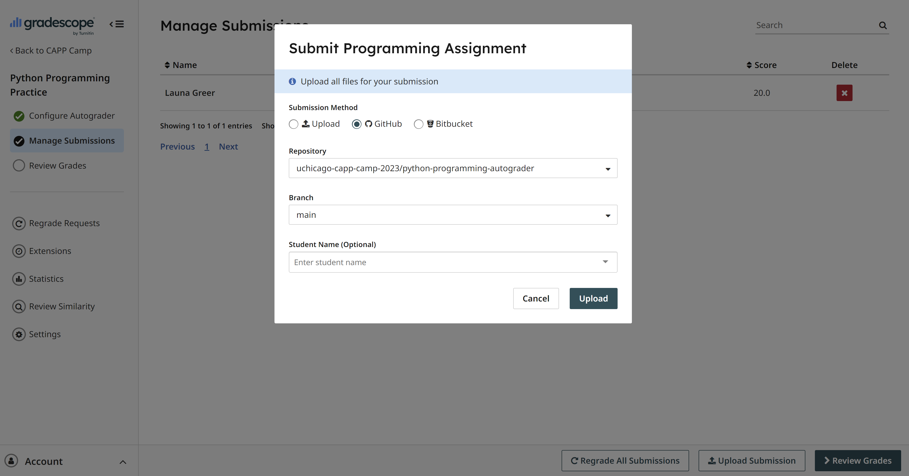

# Exercise: Mock Homework Assignment

In this exercise, you will practice the homework assignment workflow for CAPP 30121 by cloning a GitHub repo generated by GitHub Classroom, updating the repo's code to make sure that its functions pass a series of automated tests, and then submitting your repository to Gradescope, where it will be automatically scored.

## Setup

1. Navigate to the GitHub Classroom invitation for the `python-programming` assignment by clicking this link [here](https://classroom.github.com/a/Fx3Bh91O).

{:style="counter-reset:none"}
2. Join the classroom if prompted and then click "Next".

{:style="counter-reset:none"}
3. Click on the green "Accept this assignment" button and a new repository will be generated for you. Refresh the web page until you see confirmation that the assignment repository has been created. Then click on the URL in the blue box to be redirected to your individual repository.

{:style="counter-reset:none"}
4. Once you're on your individual repository page, click on the green dropdown button with the word "Code" and copy the repository address in the SSH tab by clicking on the icon with two squares.

 -->

{:style="counter-reset:none"}
5. In your remote terminal, change to the `capp30121` directory. Run the command: `git clone {REPOSITORY_ADDRESS}`, where `{REPOSITORY_ADDRESS}` is the address that you just copied. For example, in my terminal, I would run `git clone git@github.com:uchicago-capp-camp-2023/python-programming-LaunaG.git`.

{:style="counter-reset:none"}
6. Confirm that the repository has been cloned successfully by running `ls`. You should see a folder called `python-programming-{GITHUB_USERNAME}`, where `{GITHUB_USERNAME}` is your personal GitHub username.

{:style="counter-reset:none"}
7. We will be using VS Code's file explorer to more easily open and view files.  Click on the "Open Folder" link in the "Get Started" file that is displayed in the Editor window. If you don't see a file called "Get Started", you can also go to "File > Open File" from the menu bar. Then find and click on the name of your folder, `python-programming-{GITHUB_USERNAME}`, from the dropdown and hit the button "Ok".

{:style="counter-reset:none"}
8. VS Code will then launch a new window open to your assignment directory, while still connected to the remote server through SSH. If you don't see the directory contents displayed on the lefthand side of the screen, click the "File Explorer" button (a stack of papers) in the Activity Bar to toggle the "File Explorer" open.

## Coding

You should always locate and carefully read through the instructions before beginning an assignment. For CAPP 30121, instructions will typically be located in a file called "README" and/or at the top of an assignment itself within the file's _docstring_.

Click on the file `README.md` to open it in the Editor window. Read through the instructions and then open the file `practice.py`. Complete the functions there, testing your code using `IPython`, `pytest`, and `pylint` commands as described by the `README`.

When you are done coding, make sure to add, commit, and push all of your changes to GitHub.

## Submitting Your Code on Gradescope

1. Navigate to our Gradescope course dashboard through the link on Canvas.

{:style="counter-reset:none"}
2. Click on the assignment "Python Programming Practice" and then click the radio button for submitting your code using GitHub. Authorize Gradescope to use GitHub, and then select the name of your repo (`python-programming-{GITHUB_USERNAME}`) and branch (`main`), and hit the button to submit/upload your code.

{:style="counter-reset:none"}
3. Following submission, an autograder will automatically begin running tests against your code to generate a score.  In CAPP 30121, your homework assignment score will based on both "Completeness"--how many tests you pass correctly--as well as additional coding style and syntax errors that the autograder might not catch. Style and syntax criteria will be manually graded by your instructor and TAs.

{:style="counter-reset:none"}
4. Check out your score. If you missed points, try fixing and testing your code again, pushing your new changes to GitHub, and then resubmitting the assignment.

{:style="text-align:center"}
[Advanced Resources](../advanced/index.html){: .btn }